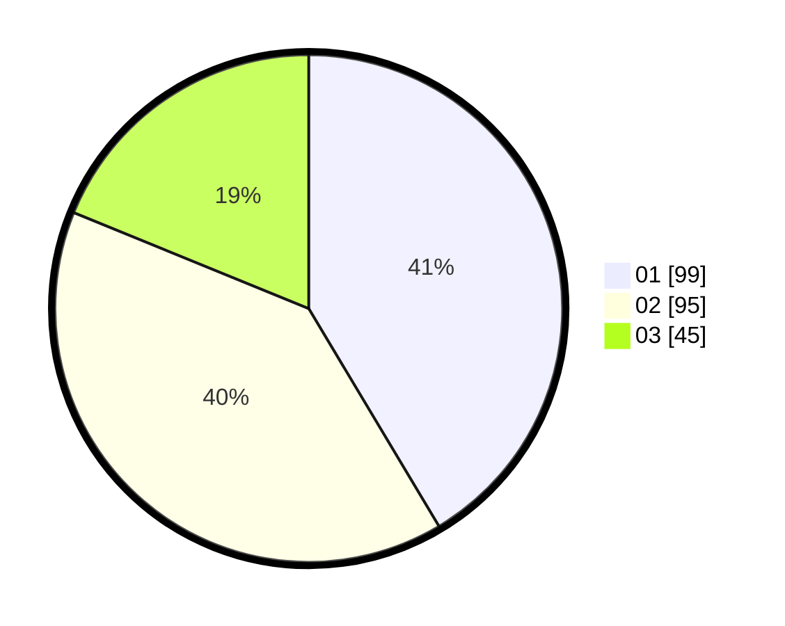

# Hasil

Hasil perolehan suara paslon dapat dilihat pada file paslon-01.txt, paslon-02.txt, dan paslon-03.txt.

Jika tidak ada, artinya data tersebut belum ada pada SIREKAP.

## Perolehan Suara

 * Paslon 01: **99**.
 * Paslon 02: **95**.
 * Paslon 03: **45**.

## Foto C Plano

https://sirekap-obj-formc.kpu.go.id/93ae/pemilu/ppwp/31/75/09/10/02/3175091002030-20240216-024628--8f87fa9c-04b5-4be9-bd97-4e7143e52e82.jpg

https://sirekap-obj-formc.kpu.go.id/93ae/pemilu/ppwp/31/75/09/10/02/3175091002030-20240216-024630--4420cc9f-092d-445f-bf50-a0a0da7986a7.jpg

https://sirekap-obj-formc.kpu.go.id/93ae/pemilu/ppwp/31/75/09/10/02/3175091002030-20240216-024629--00b6fcc8-bfdd-4963-9971-f3f2707bf3c4.jpg

## DATA PEMILIH TETAP

Jumlah pemilih dalam DPT: **285**.
 * L: **151**.
 * P: **134**.

## DATA PENGGUNA HAK PILIH

Jumlah pengguna hak pilih dalam DPT: **240**.
 * L: **122**.
 * P: **118**.

Jumlah pengguna hak pilih dalam DPTb: **0**.
 * L: **0**.
 * P: **0**.

Jumlah pengguna hak pilih dalam DPK: **2**.
 * L: **2**.
 * P: **0**.

Jumlah pengguna hak pilih: **242**.
 * L: **124**.
 * P: **118**.

## JUMLAH SUARA SAH DAN TIDAK SAH

JUMLAH SELURUH SUARA SAH: **239**.

JUMLAH SUARA TIDAK SAH: **3**.

JUMLAH SELURUH SUARA SAH DAN SUARA TIDAK SAH: **242**.
