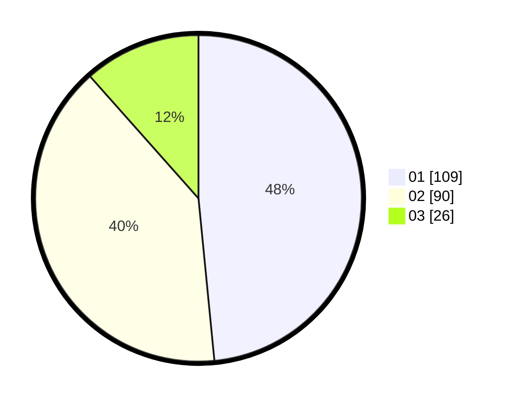

# Hasil

Hasil perolehan suara paslon dapat dilihat pada file paslon-01.txt, paslon-02.txt, dan paslon-03.txt.

Jika tidak ada, artinya data tersebut belum ada pada SIREKAP.

## Perolehan Suara

 * Paslon 01: **109**.
 * Paslon 02: **90**.
 * Paslon 03: **26**.

## Foto C Plano

https://sirekap-obj-formc.kpu.go.id/578c/pemilu/ppwp/31/75/09/10/02/3175091002031-20240214-220221--00c29465-3b7f-4d9a-831f-8e468d72746b.jpg

https://sirekap-obj-formc.kpu.go.id/578c/pemilu/ppwp/31/75/09/10/02/3175091002031-20240214-204847--6a57816a-2889-45ba-bd84-2ac899e913d8.jpg

https://sirekap-obj-formc.kpu.go.id/578c/pemilu/ppwp/31/75/09/10/02/3175091002031-20240214-205411--5ef24bc5-2a18-4961-8a67-80542c4d6dee.jpg

## DATA PEMILIH TETAP

Jumlah pemilih dalam DPT: **276**.
 * L: **139**.
 * P: **137**.

## DATA PENGGUNA HAK PILIH

Jumlah pengguna hak pilih dalam DPT: **224**.
 * L: **108**.
 * P: **116**.

Jumlah pengguna hak pilih dalam DPTb: **1**.
 * L: **0**.
 * P: **1**.

Jumlah pengguna hak pilih dalam DPK: **2**.
 * L: **2**.
 * P: **0**.

Jumlah pengguna hak pilih: **227**.
 * L: **110**.
 * P: **117**.

## JUMLAH SUARA SAH DAN TIDAK SAH

JUMLAH SELURUH SUARA SAH: **225**.

JUMLAH SUARA TIDAK SAH: **2**.

JUMLAH SELURUH SUARA SAH DAN SUARA TIDAK SAH: **227**.
