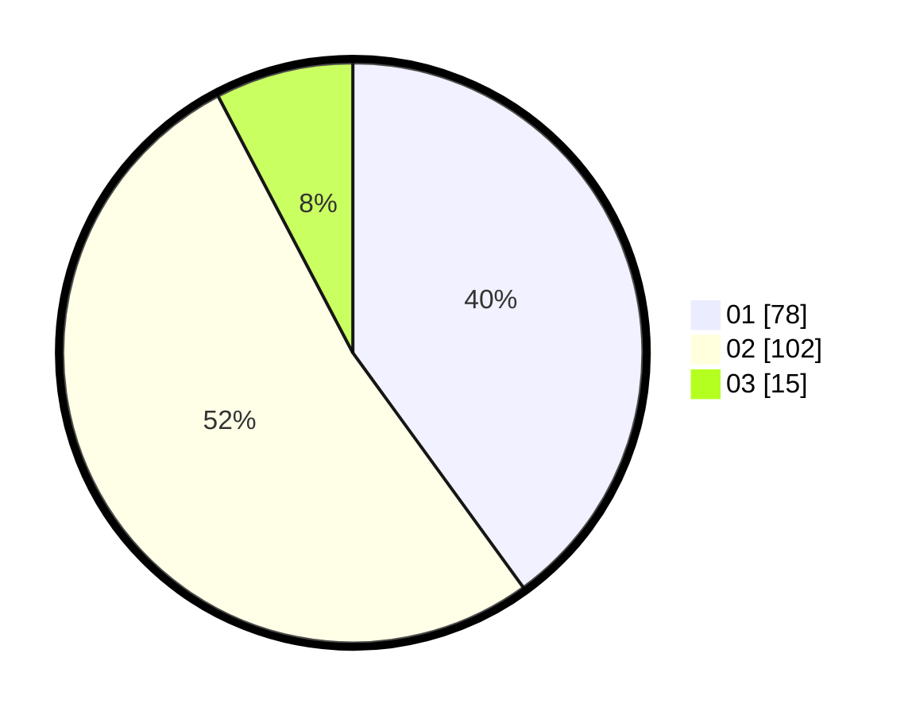

# Hasil

Hasil perolehan suara paslon dapat dilihat pada file paslon-01.txt, paslon-02.txt, dan paslon-03.txt.

Jika tidak ada, artinya data tersebut belum ada pada SIREKAP.

## Perolehan Suara

 * Paslon 01: **78**.
 * Paslon 02: **102**.
 * Paslon 03: **15**.

## Foto C Plano

https://sirekap-obj-formc.kpu.go.id/712c/pemilu/ppwp/31/75/09/10/02/3175091002035-20240214-201403--9a08defa-377e-429a-8902-00a474e17d70.jpg

https://sirekap-obj-formc.kpu.go.id/712c/pemilu/ppwp/31/75/09/10/02/3175091002035-20240214-201537--28ce7fd2-3ed8-42b3-8304-703829da09be.jpg

https://sirekap-obj-formc.kpu.go.id/712c/pemilu/ppwp/31/75/09/10/02/3175091002035-20240214-201628--0d9ae0c2-0b91-46ef-8782-9a5e9e759826.jpg

## DATA PEMILIH TETAP

Jumlah pemilih dalam DPT: **272**.
 * L: **132**.
 * P: **140**.

## DATA PENGGUNA HAK PILIH

Jumlah pengguna hak pilih dalam DPT: **199**.
 * L: **93**.
 * P: **106**.

Jumlah pengguna hak pilih dalam DPTb: **1**.
 * L: **1**.
 * P: **0**.

Jumlah pengguna hak pilih dalam DPK: **0**.
 * L: **0**.
 * P: **0**.

Jumlah pengguna hak pilih: **200**.
 * L: **94**.
 * P: **106**.

## JUMLAH SUARA SAH DAN TIDAK SAH

JUMLAH SELURUH SUARA SAH: **195**.

JUMLAH SUARA TIDAK SAH: **5**.

JUMLAH SELURUH SUARA SAH DAN SUARA TIDAK SAH: **200**.
