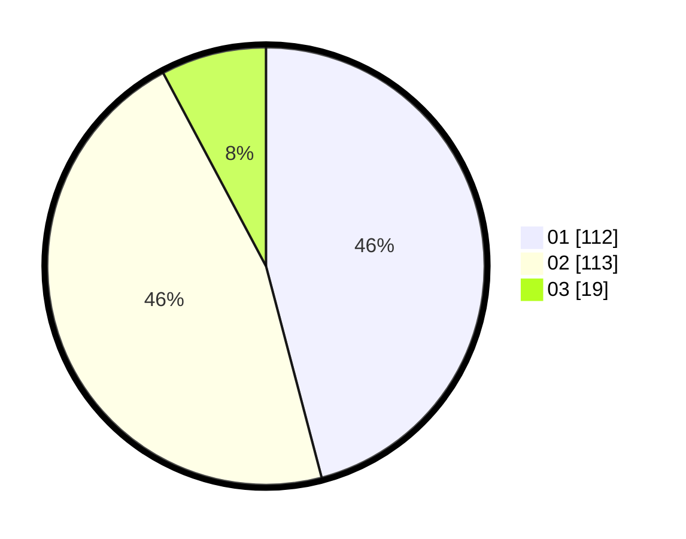

# Hasil

Hasil perolehan suara paslon dapat dilihat pada file paslon-01.txt, paslon-02.txt, dan paslon-03.txt.

Jika tidak ada, artinya data tersebut belum ada pada SIREKAP.

## Perolehan Suara

 * Paslon 01: **112**.
 * Paslon 02: **113**.
 * Paslon 03: **19**.

## Foto C Plano

https://sirekap-obj-formc.kpu.go.id/6402/pemilu/ppwp/31/75/09/10/02/3175091002037-20240214-155046--f74d09f5-9124-41fe-af16-2255d1664e9a.jpg

https://sirekap-obj-formc.kpu.go.id/6402/pemilu/ppwp/31/75/09/10/02/3175091002037-20240214-155024--398d114a-a1a2-4b04-b55e-ade4a66209a7.jpg

https://sirekap-obj-formc.kpu.go.id/6402/pemilu/ppwp/31/75/09/10/02/3175091002037-20240214-155415--52164cf1-2d70-4837-ba0e-4d9711ee6238.jpg

## DATA PEMILIH TETAP

Jumlah pemilih dalam DPT: **244**.
 * L: **121**.
 * P: **123**.

## DATA PENGGUNA HAK PILIH

Jumlah pengguna hak pilih dalam DPT: **244**.
 * L: **121**.
 * P: **123**.

Jumlah pengguna hak pilih dalam DPTb: **0**.
 * L: **0**.
 * P: **0**.

Jumlah pengguna hak pilih dalam DPK: **1**.
 * L: **0**.
 * P: **1**.

Jumlah pengguna hak pilih: **245**.
 * L: **121**.
 * P: **124**.

## JUMLAH SUARA SAH DAN TIDAK SAH

JUMLAH SELURUH SUARA SAH: **244**.

JUMLAH SUARA TIDAK SAH: **1**.

JUMLAH SELURUH SUARA SAH DAN SUARA TIDAK SAH: **245**.
