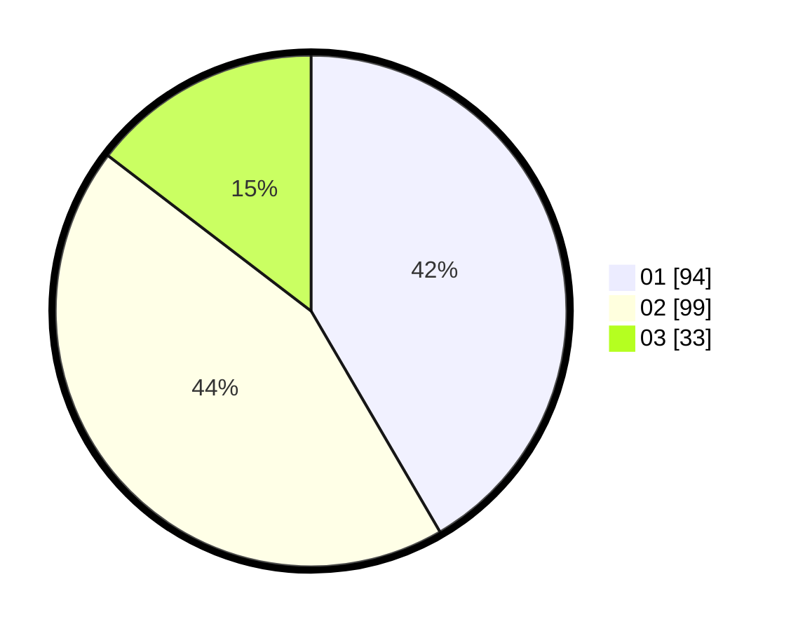

# Hasil

Hasil perolehan suara paslon dapat dilihat pada file paslon-01.txt, paslon-02.txt, dan paslon-03.txt.

Jika tidak ada, artinya data tersebut belum ada pada SIREKAP.

## Perolehan Suara

 * Paslon 01: **94**.
 * Paslon 02: **99**.
 * Paslon 03: **33**.

## Foto C Plano

https://sirekap-obj-formc.kpu.go.id/a72c/pemilu/ppwp/31/75/09/10/02/3175091002041-20240214-192436--f4a769fb-6345-441d-a49d-37c5f0d02ea9.jpg

https://sirekap-obj-formc.kpu.go.id/a72c/pemilu/ppwp/31/75/09/10/02/3175091002041-20240214-192205--a946e183-55a5-4a1a-8a20-95eeea56ed6b.jpg

https://sirekap-obj-formc.kpu.go.id/a72c/pemilu/ppwp/31/75/09/10/02/3175091002041-20240214-192613--c1c1d7f5-8d09-43e8-98e3-c6f987c36083.jpg

## DATA PEMILIH TETAP

Jumlah pemilih dalam DPT: **282**.
 * L: **139**.
 * P: **143**.

## DATA PENGGUNA HAK PILIH

Jumlah pengguna hak pilih dalam DPT: **227**.
 * L: **108**.
 * P: **119**.

Jumlah pengguna hak pilih dalam DPTb: **0**.
 * L: **0**.
 * P: **0**.

Jumlah pengguna hak pilih dalam DPK: **0**.
 * L: **0**.
 * P: **0**.

Jumlah pengguna hak pilih: **227**.
 * L: **108**.
 * P: **119**.

## JUMLAH SUARA SAH DAN TIDAK SAH

JUMLAH SELURUH SUARA SAH: **224**.

JUMLAH SUARA TIDAK SAH: **3**.

JUMLAH SELURUH SUARA SAH DAN SUARA TIDAK SAH: **227**.
