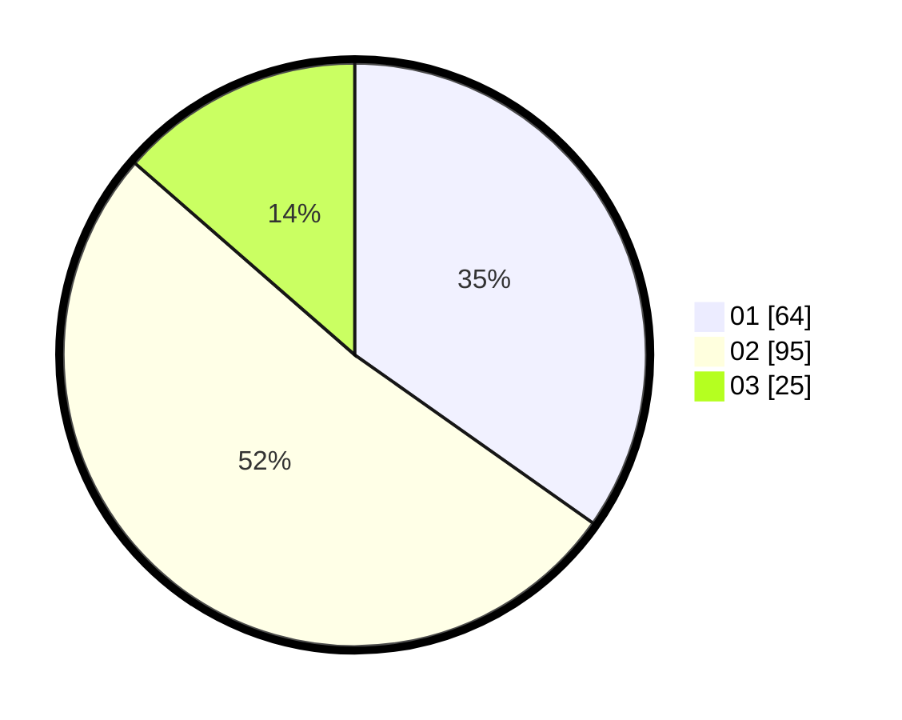

# Hasil

Hasil perolehan suara paslon dapat dilihat pada file paslon-01.txt, paslon-02.txt, dan paslon-03.txt.

Jika tidak ada, artinya data tersebut belum ada pada SIREKAP.

## Perolehan Suara

 * Paslon 01: **64**.
 * Paslon 02: **95**.
 * Paslon 03: **25**.

## Foto C Plano

https://sirekap-obj-formc.kpu.go.id/c344/pemilu/ppwp/31/75/09/10/02/3175091002046-20240214-195636--084226bf-9bc4-4cc0-b08c-a149d79270a9.jpg

https://sirekap-obj-formc.kpu.go.id/c344/pemilu/ppwp/31/75/09/10/02/3175091002046-20240214-195647--31b7ce3e-4f27-4198-ac6b-3d0db5fdf007.jpg

https://sirekap-obj-formc.kpu.go.id/c344/pemilu/ppwp/31/75/09/10/02/3175091002046-20240214-195654--df33b502-beaf-4fb9-973c-1df0e049fd66.jpg

## DATA PEMILIH TETAP

Jumlah pemilih dalam DPT: **250**.
 * L: **110**.
 * P: **140**.

## DATA PENGGUNA HAK PILIH

Jumlah pengguna hak pilih dalam DPT: **184**.
 * L: **81**.
 * P: **103**.

Jumlah pengguna hak pilih dalam DPTb: **1**.
 * L: **0**.
 * P: **1**.

Jumlah pengguna hak pilih dalam DPK: **0**.
 * L: **0**.
 * P: **0**.

Jumlah pengguna hak pilih: **185**.
 * L: **81**.
 * P: **104**.

## JUMLAH SUARA SAH DAN TIDAK SAH

JUMLAH SELURUH SUARA SAH: **184**.

JUMLAH SUARA TIDAK SAH: **1**.

JUMLAH SELURUH SUARA SAH DAN SUARA TIDAK SAH: **185**.
