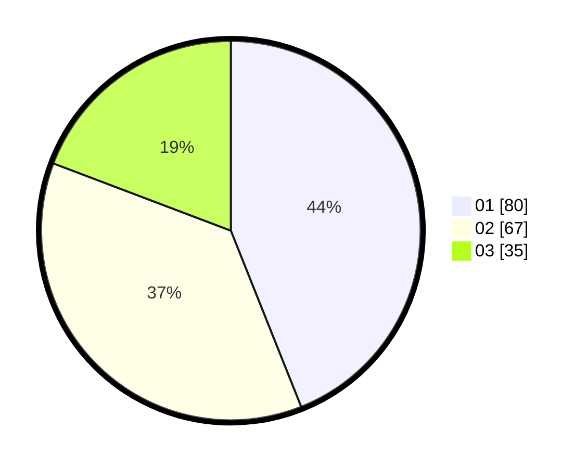

# Hasil

Hasil perolehan suara paslon dapat dilihat pada file paslon-01.txt, paslon-02.txt, dan paslon-03.txt.

Jika tidak ada, artinya data tersebut belum ada pada SIREKAP.

## Perolehan Suara

 * Paslon 01: **80**.
 * Paslon 02: **67**.
 * Paslon 03: **35**.

## Foto C Plano

https://sirekap-obj-formc.kpu.go.id/3508/pemilu/ppwp/31/75/09/10/02/3175091002047-20240214-230155--a1cb7481-81e5-4751-9117-3d732796ec77.jpg

https://sirekap-obj-formc.kpu.go.id/3508/pemilu/ppwp/31/75/09/10/02/3175091002047-20240214-184511--2cfec06c-8dad-49fa-bd16-3fad0b1f2009.jpg

https://sirekap-obj-formc.kpu.go.id/3508/pemilu/ppwp/31/75/09/10/02/3175091002047-20240214-184748--35884f37-3125-476d-a140-8f7aa5632664.jpg
