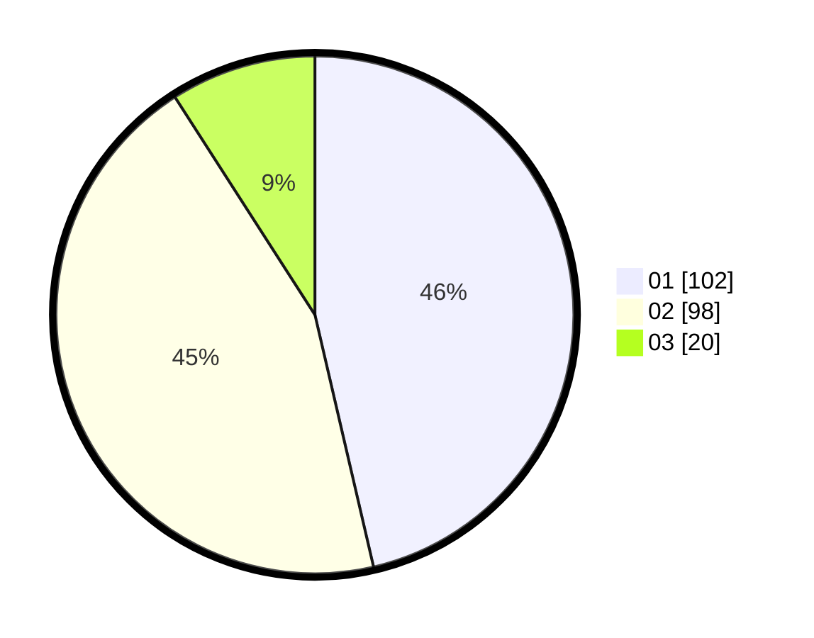

# Hasil

Hasil perolehan suara paslon dapat dilihat pada file paslon-01.txt, paslon-02.txt, dan paslon-03.txt.

Jika tidak ada, artinya data tersebut belum ada pada SIREKAP.

## Perolehan Suara

 * Paslon 01: **102**.
 * Paslon 02: **98**.
 * Paslon 03: **20**.

## Foto C Plano

https://sirekap-obj-formc.kpu.go.id/d590/pemilu/ppwp/31/75/09/10/02/3175091002059-20240214-190421--5d12164e-c80e-4f14-a568-5b69299be030.jpg

https://sirekap-obj-formc.kpu.go.id/d590/pemilu/ppwp/31/75/09/10/02/3175091002059-20240214-190151--c84ac13e-85ad-4f76-b012-924c71a0aa21.jpg

https://sirekap-obj-formc.kpu.go.id/d590/pemilu/ppwp/31/75/09/10/02/3175091002059-20240214-190608--60b77ab2-e4ea-48d3-a349-c7337f0ca493.jpg

## DATA PEMILIH TETAP

Jumlah pemilih dalam DPT: **273**.
 * L: **132**.
 * P: **141**.

## DATA PENGGUNA HAK PILIH

Jumlah pengguna hak pilih dalam DPT: **218**.
 * L: **104**.
 * P: **114**.

Jumlah pengguna hak pilih dalam DPTb: **2**.
 * L: **2**.
 * P: **0**.

Jumlah pengguna hak pilih dalam DPK: **2**.
 * L: **1**.
 * P: **1**.

Jumlah pengguna hak pilih: **222**.
 * L: **107**.
 * P: **115**.

## JUMLAH SUARA SAH DAN TIDAK SAH

JUMLAH SELURUH SUARA SAH: **220**.

JUMLAH SUARA TIDAK SAH: **2**.

JUMLAH SELURUH SUARA SAH DAN SUARA TIDAK SAH: **222**.
