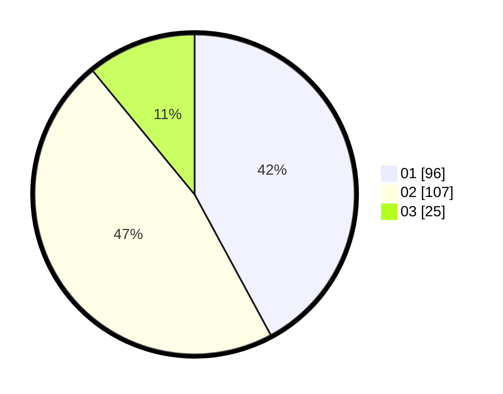

# Hasil

Hasil perolehan suara paslon dapat dilihat pada file paslon-01.txt, paslon-02.txt, dan paslon-03.txt.

Jika tidak ada, artinya data tersebut belum ada pada SIREKAP.

## Perolehan Suara

 * Paslon 01: **96**.
 * Paslon 02: **107**.
 * Paslon 03: **25**.

## Foto C Plano

https://sirekap-obj-formc.kpu.go.id/a44a/pemilu/ppwp/31/75/09/10/02/3175091002061-20240215-012150--78fdd3aa-6123-4825-88b5-e2ba691dc75e.jpg

https://sirekap-obj-formc.kpu.go.id/a44a/pemilu/ppwp/31/75/09/10/02/3175091002061-20240215-012230--2a66622c-1d05-4a41-9d69-12e71dfbb174.jpg

https://sirekap-obj-formc.kpu.go.id/a44a/pemilu/ppwp/31/75/09/10/02/3175091002061-20240215-012318--662ec97c-98ec-44c1-a03b-55d230f34206.jpg

## DATA PEMILIH TETAP

Jumlah pemilih dalam DPT: **275**.
 * L: **122**.
 * P: **153**.

## DATA PENGGUNA HAK PILIH

Jumlah pengguna hak pilih dalam DPT: **226**.
 * L: **100**.
 * P: **126**.

Jumlah pengguna hak pilih dalam DPTb: **2**.
 * L: **2**.
 * P: **0**.

Jumlah pengguna hak pilih dalam DPK: **0**.
 * L: **0**.
 * P: **0**.

Jumlah pengguna hak pilih: **228**.
 * L: **102**.
 * P: **126**.

## JUMLAH SUARA SAH DAN TIDAK SAH

JUMLAH SELURUH SUARA SAH: **228**.

JUMLAH SUARA TIDAK SAH: **0**.

JUMLAH SELURUH SUARA SAH DAN SUARA TIDAK SAH: **228**.
