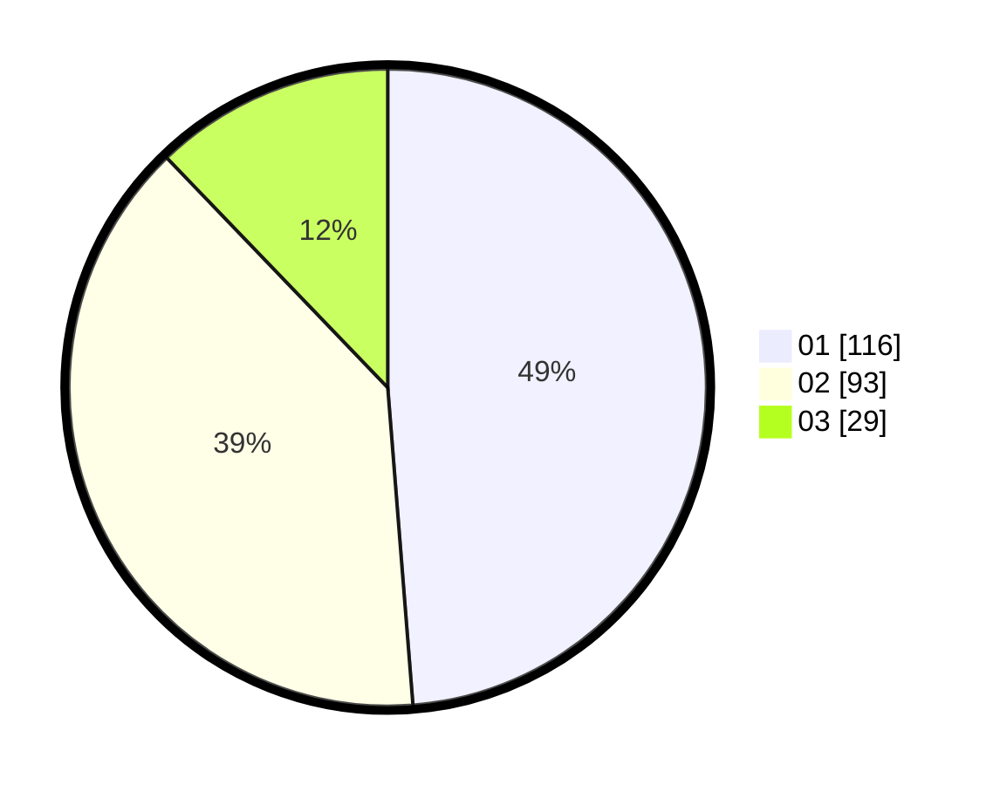

# Hasil

Hasil perolehan suara paslon dapat dilihat pada file paslon-01.txt, paslon-02.txt, dan paslon-03.txt.

Jika tidak ada, artinya data tersebut belum ada pada SIREKAP.

## Perolehan Suara

 * Paslon 01: **116**.
 * Paslon 02: **93**.
 * Paslon 03: **29**.

## Foto C Plano

https://sirekap-obj-formc.kpu.go.id/84fe/pemilu/ppwp/31/75/09/10/02/3175091002073-20240217-011906--96e8d845-33ef-43f4-adf7-45229eb43c12.jpg

https://sirekap-obj-formc.kpu.go.id/84fe/pemilu/ppwp/31/75/09/10/02/3175091002073-20240217-011907--259afa79-7584-43a6-9419-fc9f9f8b8866.jpg

https://sirekap-obj-formc.kpu.go.id/84fe/pemilu/ppwp/31/75/09/10/02/3175091002073-20240217-011906--605355dc-5bae-4a7f-87c6-21588e8ea564.jpg

## DATA PEMILIH TETAP

Jumlah pemilih dalam DPT: **283**.
 * L: **143**.
 * P: **140**.

## DATA PENGGUNA HAK PILIH

Jumlah pengguna hak pilih dalam DPT: **237**.
 * L: **123**.
 * P: **114**.

Jumlah pengguna hak pilih dalam DPTb: **4**.
 * L: **2**.
 * P: **2**.

Jumlah pengguna hak pilih dalam DPK: **0**.
 * L: **0**.
 * P: **0**.

Jumlah pengguna hak pilih: **241**.
 * L: **125**.
 * P: **116**.

## JUMLAH SUARA SAH DAN TIDAK SAH

JUMLAH SELURUH SUARA SAH: **238**.

JUMLAH SUARA TIDAK SAH: **3**.

JUMLAH SELURUH SUARA SAH DAN SUARA TIDAK SAH: **241**.
