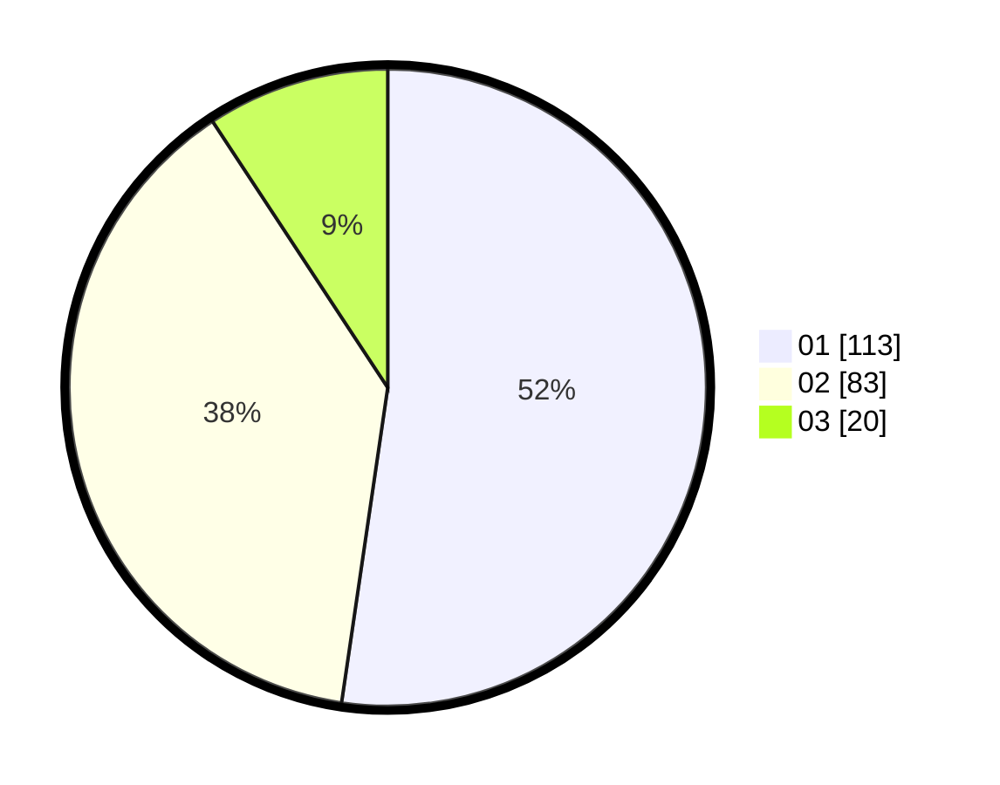

# Hasil

Hasil perolehan suara paslon dapat dilihat pada file paslon-01.txt, paslon-02.txt, dan paslon-03.txt.

Jika tidak ada, artinya data tersebut belum ada pada SIREKAP.

## Perolehan Suara

 * Paslon 01: **113**.
 * Paslon 02: **83**.
 * Paslon 03: **20**.

## Foto C Plano

https://sirekap-obj-formc.kpu.go.id/0e4c/pemilu/ppwp/31/75/09/10/02/3175091002076-20240214-190642--7360cbef-8b52-4a45-969d-15e72909b00a.jpg

https://sirekap-obj-formc.kpu.go.id/0e4c/pemilu/ppwp/31/75/09/10/02/3175091002076-20240214-190652--9e713232-6c04-41d8-9314-aa7c891be2f9.jpg

https://sirekap-obj-formc.kpu.go.id/0e4c/pemilu/ppwp/31/75/09/10/02/3175091002076-20240214-225633--e8a216d5-a4fc-4733-9938-ff144dc3acf5.jpg
