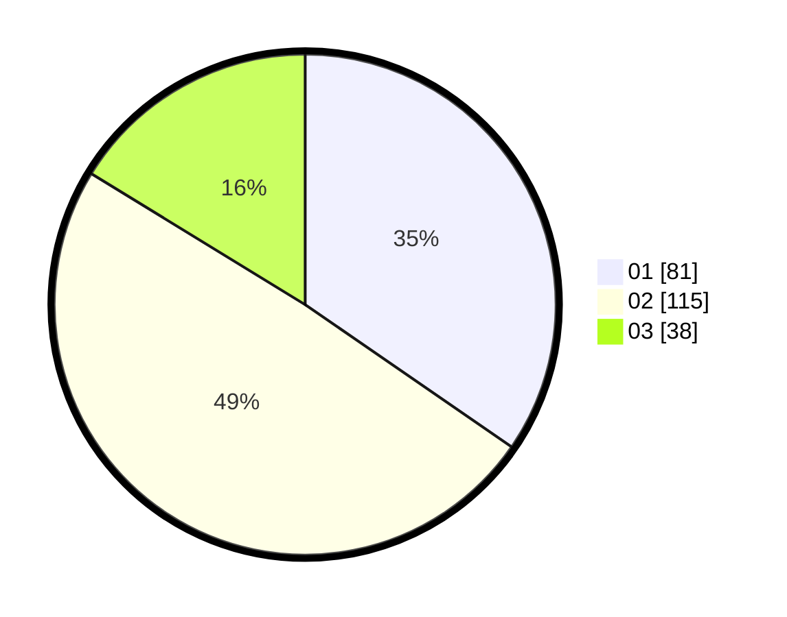

# Hasil

Hasil perolehan suara paslon dapat dilihat pada file paslon-01.txt, paslon-02.txt, dan paslon-03.txt.

Jika tidak ada, artinya data tersebut belum ada pada SIREKAP.

## Perolehan Suara

 * Paslon 01: **81**.
 * Paslon 02: **115**.
 * Paslon 03: **38**.

## Foto C Plano

https://sirekap-obj-formc.kpu.go.id/c60e/pemilu/ppwp/31/75/09/10/02/3175091002078-20240215-005653--c3e75b9e-d461-44d5-aae7-f537aaea64b9.jpg

https://sirekap-obj-formc.kpu.go.id/c60e/pemilu/ppwp/31/75/09/10/02/3175091002078-20240214-210442--cfcde10e-3318-46a3-b1b9-37ca20300dda.jpg

https://sirekap-obj-formc.kpu.go.id/c60e/pemilu/ppwp/31/75/09/10/02/3175091002078-20240214-210457--2ae3d258-db23-45c6-bf57-dad2825c8888.jpg
