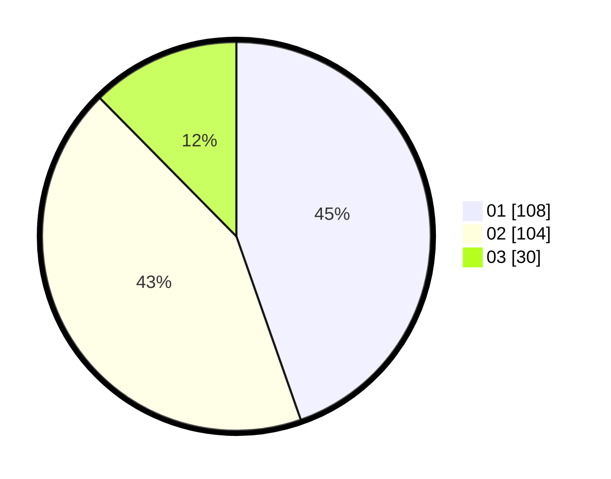

# Hasil

Hasil perolehan suara paslon dapat dilihat pada file paslon-01.txt, paslon-02.txt, dan paslon-03.txt.

Jika tidak ada, artinya data tersebut belum ada pada SIREKAP.

## Perolehan Suara

 * Paslon 01: **108**.
 * Paslon 02: **104**.
 * Paslon 03: **30**.

## Foto C Plano

https://sirekap-obj-formc.kpu.go.id/ef19/pemilu/ppwp/31/75/09/10/02/3175091002089-20240214-225822--58fc2a15-c480-4431-ab36-b875833ff6ae.jpg

https://sirekap-obj-formc.kpu.go.id/ef19/pemilu/ppwp/31/75/09/10/02/3175091002089-20240214-225508--f66f06ba-1318-4bad-b554-7ea7cdf108d6.jpg
