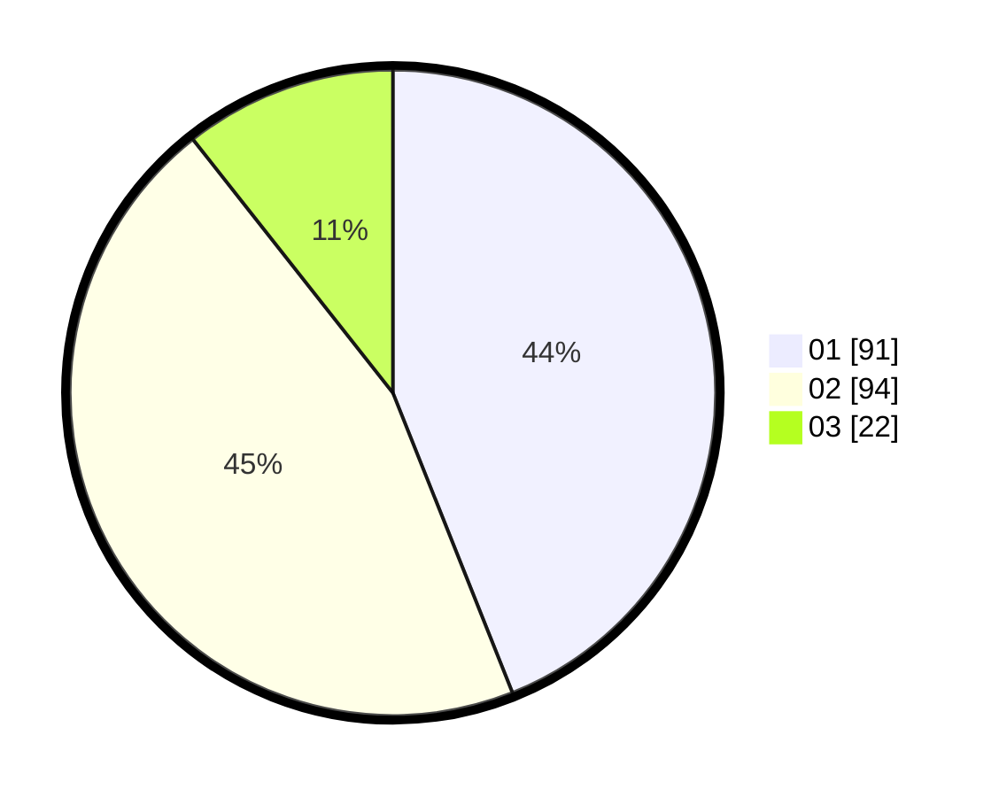

# Hasil

Hasil perolehan suara paslon dapat dilihat pada file paslon-01.txt, paslon-02.txt, dan paslon-03.txt.

Jika tidak ada, artinya data tersebut belum ada pada SIREKAP.

## Perolehan Suara

 * Paslon 01: **91**.
 * Paslon 02: **94**.
 * Paslon 03: **22**.

## Foto C Plano

https://sirekap-obj-formc.kpu.go.id/2625/pemilu/ppwp/31/75/09/10/02/3175091002090-20240214-155010--23cf805d-e6e3-4107-b175-4a826497b7b3.jpg

https://sirekap-obj-formc.kpu.go.id/2625/pemilu/ppwp/31/75/09/10/02/3175091002090-20240214-224657--66c6cd65-37a2-4374-a5be-ba913d887605.jpg

https://sirekap-obj-formc.kpu.go.id/2625/pemilu/ppwp/31/75/09/10/02/3175091002090-20240218-170740--20e3e68f-b019-4997-a6ba-43249f0d6542.jpg

## DATA PEMILIH TETAP

Jumlah pemilih dalam DPT: **276**.
 * L: **131**.
 * P: **145**.

## DATA PENGGUNA HAK PILIH

Jumlah pengguna hak pilih dalam DPT: **202**.
 * L: **88**.
 * P: **114**.

Jumlah pengguna hak pilih dalam DPTb: **0**.
 * L: **0**.
 * P: **0**.

Jumlah pengguna hak pilih dalam DPK: **6**.
 * L: **1**.
 * P: **5**.

Jumlah pengguna hak pilih: **208**.
 * L: **89**.
 * P: **119**.

## JUMLAH SUARA SAH DAN TIDAK SAH

JUMLAH SELURUH SUARA SAH: **207**.

JUMLAH SUARA TIDAK SAH: **1**.

JUMLAH SELURUH SUARA SAH DAN SUARA TIDAK SAH: **208**.
