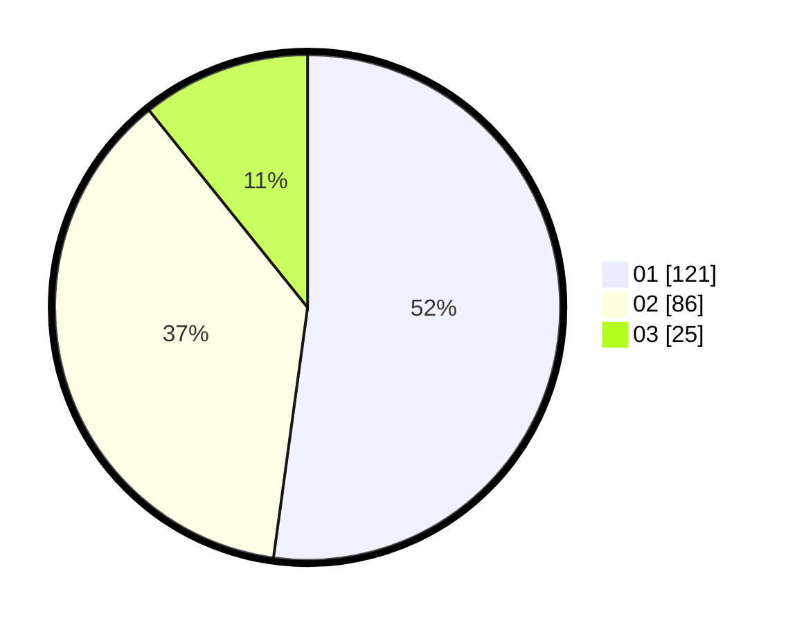

# Hasil

Hasil perolehan suara paslon dapat dilihat pada file paslon-01.txt, paslon-02.txt, dan paslon-03.txt.

Jika tidak ada, artinya data tersebut belum ada pada SIREKAP.

## Perolehan Suara

 * Paslon 01: **121**.
 * Paslon 02: **86**.
 * Paslon 03: **25**.

## Foto C Plano

https://sirekap-obj-formc.kpu.go.id/5ef8/pemilu/ppwp/31/75/09/10/02/3175091002091-20240214-212308--e8ee7311-d975-4809-bcea-f46b94e5ac76.jpg

https://sirekap-obj-formc.kpu.go.id/5ef8/pemilu/ppwp/31/75/09/10/02/3175091002091-20240214-212311--1306d0cf-5cc9-4f9d-9b2c-0a8939fd19de.jpg

https://sirekap-obj-formc.kpu.go.id/5ef8/pemilu/ppwp/31/75/09/10/02/3175091002091-20240214-212314--9c9b6b6a-9120-415d-95eb-16c3d5813cb9.jpg

## DATA PEMILIH TETAP

Jumlah pemilih dalam DPT: **276**.
 * L: **140**.
 * P: **136**.

## DATA PENGGUNA HAK PILIH

Jumlah pengguna hak pilih dalam DPT: **235**.
 * L: **114**.
 * P: **121**.

Jumlah pengguna hak pilih dalam DPTb: **1**.
 * L: **0**.
 * P: **1**.

Jumlah pengguna hak pilih dalam DPK: **0**.
 * L: **0**.
 * P: **0**.

Jumlah pengguna hak pilih: **236**.
 * L: **114**.
 * P: **122**.

## JUMLAH SUARA SAH DAN TIDAK SAH

JUMLAH SELURUH SUARA SAH: **232**.

JUMLAH SUARA TIDAK SAH: **4**.

JUMLAH SELURUH SUARA SAH DAN SUARA TIDAK SAH: **236**.
