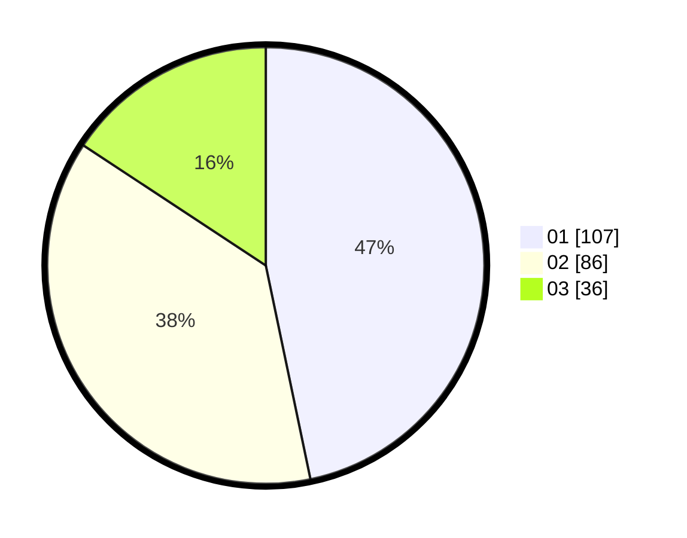

# Hasil

Hasil perolehan suara paslon dapat dilihat pada file paslon-01.txt, paslon-02.txt, dan paslon-03.txt.

Jika tidak ada, artinya data tersebut belum ada pada SIREKAP.

## Perolehan Suara

 * Paslon 01: **107**.
 * Paslon 02: **86**.
 * Paslon 03: **36**.

## Foto C Plano

https://sirekap-obj-formc.kpu.go.id/1ff4/pemilu/ppwp/31/75/09/10/02/3175091002101-20240215-162620--97a1b300-e924-45ee-a052-976e3975717a.jpg

https://sirekap-obj-formc.kpu.go.id/1ff4/pemilu/ppwp/31/75/09/10/02/3175091002101-20240216-222649--8f8e00f3-a277-413b-82d0-bdda6d56782b.jpg

https://sirekap-obj-formc.kpu.go.id/1ff4/pemilu/ppwp/31/75/09/10/02/3175091002101-20240216-222750--c21c07ba-aa04-4c67-aba6-31d3ae228ed3.jpg

## DATA PEMILIH TETAP

Jumlah pemilih dalam DPT: **281**.
 * L: **135**.
 * P: **146**.

## DATA PENGGUNA HAK PILIH

Jumlah pengguna hak pilih dalam DPT: **230**.
 * L: **110**.
 * P: **120**.

Jumlah pengguna hak pilih dalam DPTb: **1**.
 * L: **0**.
 * P: **1**.

Jumlah pengguna hak pilih dalam DPK: **2**.
 * L: **1**.
 * P: **1**.

Jumlah pengguna hak pilih: **233**.
 * L: **111**.
 * P: **122**.

## JUMLAH SUARA SAH DAN TIDAK SAH

JUMLAH SELURUH SUARA SAH: **229**.

JUMLAH SUARA TIDAK SAH: **4**.

JUMLAH SELURUH SUARA SAH DAN SUARA TIDAK SAH: **233**.
