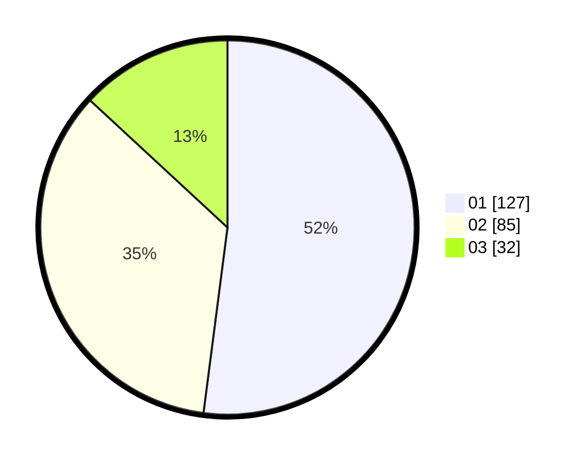

# Hasil

Hasil perolehan suara paslon dapat dilihat pada file paslon-01.txt, paslon-02.txt, dan paslon-03.txt.

Jika tidak ada, artinya data tersebut belum ada pada SIREKAP.

## Perolehan Suara

 * Paslon 01: **127**.
 * Paslon 02: **85**.
 * Paslon 03: **32**.

## Foto C Plano

https://sirekap-obj-formc.kpu.go.id/825e/pemilu/ppwp/31/75/09/10/02/3175091002102-20240214-200115--74db7d79-c26b-4b59-81c7-69496dbdb964.jpg

https://sirekap-obj-formc.kpu.go.id/825e/pemilu/ppwp/31/75/09/10/02/3175091002102-20240214-204201--2d26c4c7-4bb8-4dc7-bd80-264d94299b6e.jpg

https://sirekap-obj-formc.kpu.go.id/825e/pemilu/ppwp/31/75/09/10/02/3175091002102-20240214-204256--a185801d-7f69-457a-8c14-5c9029fa2de1.jpg

## DATA PEMILIH TETAP

Jumlah pemilih dalam DPT: **285**.
 * L: **144**.
 * P: **141**.

## DATA PENGGUNA HAK PILIH

Jumlah pengguna hak pilih dalam DPT: **247**.
 * L: **119**.
 * P: **128**.

Jumlah pengguna hak pilih dalam DPTb: **0**.
 * L: **0**.
 * P: **0**.

Jumlah pengguna hak pilih dalam DPK: **2**.
 * L: **0**.
 * P: **2**.

Jumlah pengguna hak pilih: **249**.
 * L: **119**.
 * P: **130**.

## JUMLAH SUARA SAH DAN TIDAK SAH

JUMLAH SELURUH SUARA SAH: **244**.

JUMLAH SUARA TIDAK SAH: **5**.

JUMLAH SELURUH SUARA SAH DAN SUARA TIDAK SAH: **249**.
