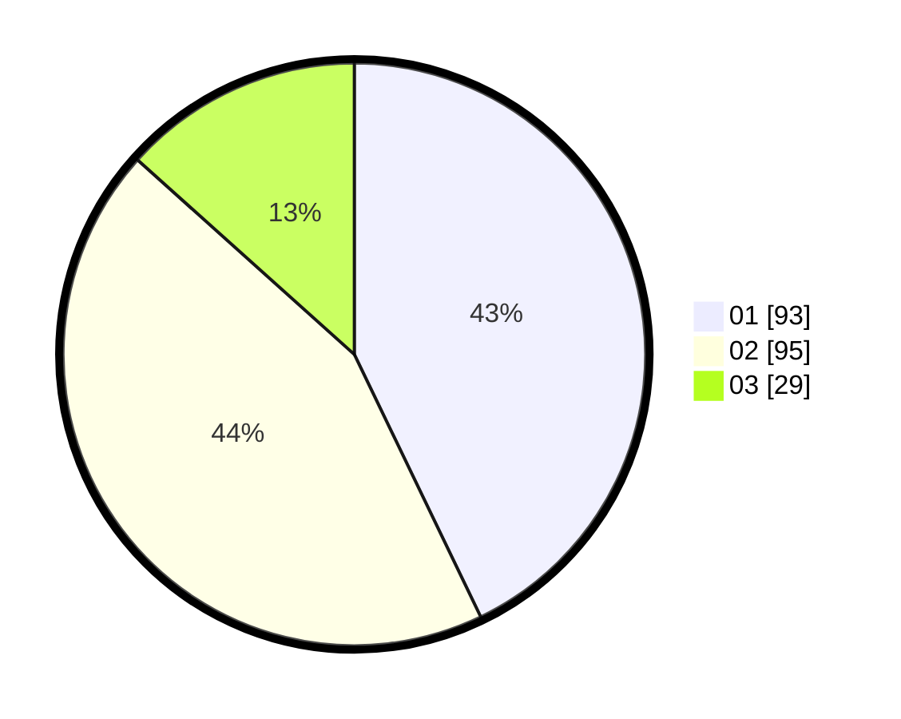

# Hasil

Hasil perolehan suara paslon dapat dilihat pada file paslon-01.txt, paslon-02.txt, dan paslon-03.txt.

Jika tidak ada, artinya data tersebut belum ada pada SIREKAP.

## Perolehan Suara

 * Paslon 01: **93**.
 * Paslon 02: **95**.
 * Paslon 03: **29**.

## Foto C Plano

https://sirekap-obj-formc.kpu.go.id/8f39/pemilu/ppwp/31/75/09/10/02/3175091002109-20240215-094721--a102e5f9-75b8-490b-afaf-f8339c649af9.jpg

https://sirekap-obj-formc.kpu.go.id/8f39/pemilu/ppwp/31/75/09/10/02/3175091002109-20240215-094742--2be6dec5-4601-4477-8830-fd88b6ac75a2.jpg

https://sirekap-obj-formc.kpu.go.id/8f39/pemilu/ppwp/31/75/09/10/02/3175091002109-20240215-094731--ab88e3ff-b833-41b4-b50c-331dc08ccd1c.jpg

## DATA PEMILIH TETAP

Jumlah pemilih dalam DPT: **275**.
 * L: **137**.
 * P: **138**.

## DATA PENGGUNA HAK PILIH

Jumlah pengguna hak pilih dalam DPT: **220**.
 * L: **102**.
 * P: **118**.

Jumlah pengguna hak pilih dalam DPTb: **1**.
 * L: **1**.
 * P: **0**.

Jumlah pengguna hak pilih dalam DPK: **0**.
 * L: **0**.
 * P: **0**.

Jumlah pengguna hak pilih: **221**.
 * L: **103**.
 * P: **118**.

## JUMLAH SUARA SAH DAN TIDAK SAH

JUMLAH SELURUH SUARA SAH: **217**.

JUMLAH SUARA TIDAK SAH: **4**.

JUMLAH SELURUH SUARA SAH DAN SUARA TIDAK SAH: **221**.
