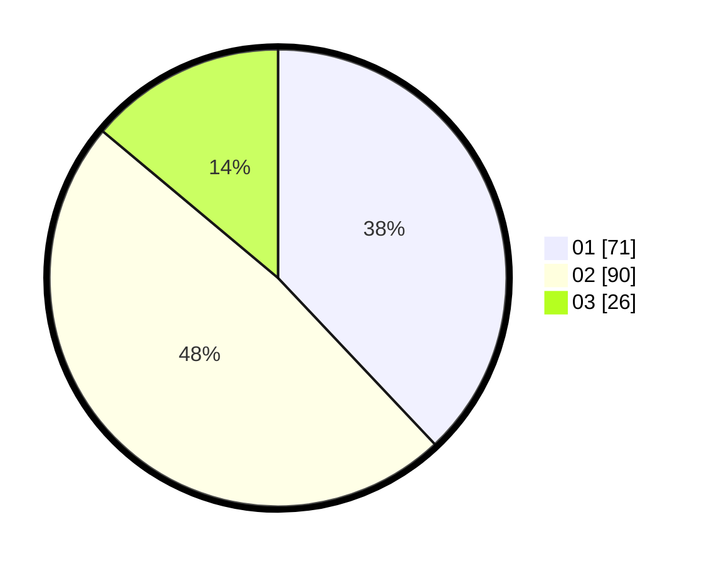

# Hasil

Hasil perolehan suara paslon dapat dilihat pada file paslon-01.txt, paslon-02.txt, dan paslon-03.txt.

Jika tidak ada, artinya data tersebut belum ada pada SIREKAP.

## Perolehan Suara

 * Paslon 01: **71**.
 * Paslon 02: **90**.
 * Paslon 03: **26**.

## Foto C Plano

https://sirekap-obj-formc.kpu.go.id/b2a5/pemilu/ppwp/31/75/09/10/02/3175091002111-20240214-221223--06f8093c-63c3-44dd-9026-5ca7b3aef763.jpg

https://sirekap-obj-formc.kpu.go.id/b2a5/pemilu/ppwp/31/75/09/10/02/3175091002111-20240214-221555--bcd2d2fc-f44e-4a16-ba01-a1c4fae91c7e.jpg

https://sirekap-obj-formc.kpu.go.id/b2a5/pemilu/ppwp/31/75/09/10/02/3175091002111-20240214-221819--3112ca00-1c8c-45dc-9bd1-b3683c9dd495.jpg
