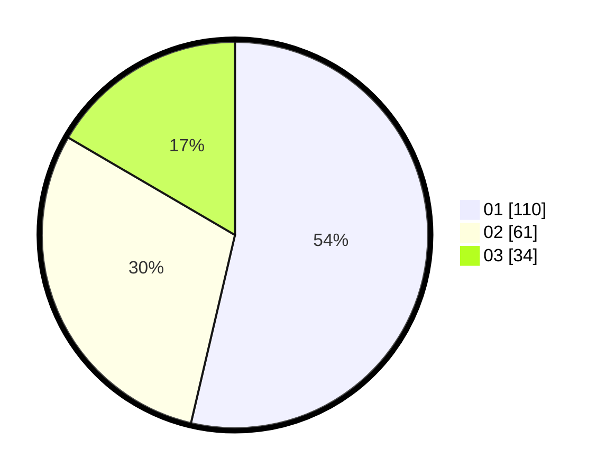

# Hasil

Hasil perolehan suara paslon dapat dilihat pada file paslon-01.txt, paslon-02.txt, dan paslon-03.txt.

Jika tidak ada, artinya data tersebut belum ada pada SIREKAP.

## Perolehan Suara

 * Paslon 01: **110**.
 * Paslon 02: **61**.
 * Paslon 03: **34**.

## Foto C Plano

https://sirekap-obj-formc.kpu.go.id/b016/pemilu/ppwp/31/75/09/10/02/3175091002120-20240214-222357--1db6074e-6248-47cb-8978-d983bd2e9160.jpg

https://sirekap-obj-formc.kpu.go.id/b016/pemilu/ppwp/31/75/09/10/02/3175091002120-20240214-222404--c8391677-eef6-4440-ab4f-54768b05bf27.jpg

https://sirekap-obj-formc.kpu.go.id/b016/pemilu/ppwp/31/75/09/10/02/3175091002120-20240214-222411--ce2061fe-1dd7-49c6-a4ee-1b3408043598.jpg

## DATA PEMILIH TETAP

Jumlah pemilih dalam DPT: **254**.
 * L: **123**.
 * P: **131**.

## DATA PENGGUNA HAK PILIH

Jumlah pengguna hak pilih dalam DPT: **208**.
 * L: **96**.
 * P: **112**.

Jumlah pengguna hak pilih dalam DPTb: **0**.
 * L: **0**.
 * P: **0**.

Jumlah pengguna hak pilih dalam DPK: **0**.
 * L: **0**.
 * P: **0**.

Jumlah pengguna hak pilih: **208**.
 * L: **96**.
 * P: **112**.

## JUMLAH SUARA SAH DAN TIDAK SAH

JUMLAH SELURUH SUARA SAH: **205**.

JUMLAH SUARA TIDAK SAH: **3**.

JUMLAH SELURUH SUARA SAH DAN SUARA TIDAK SAH: **208**.
