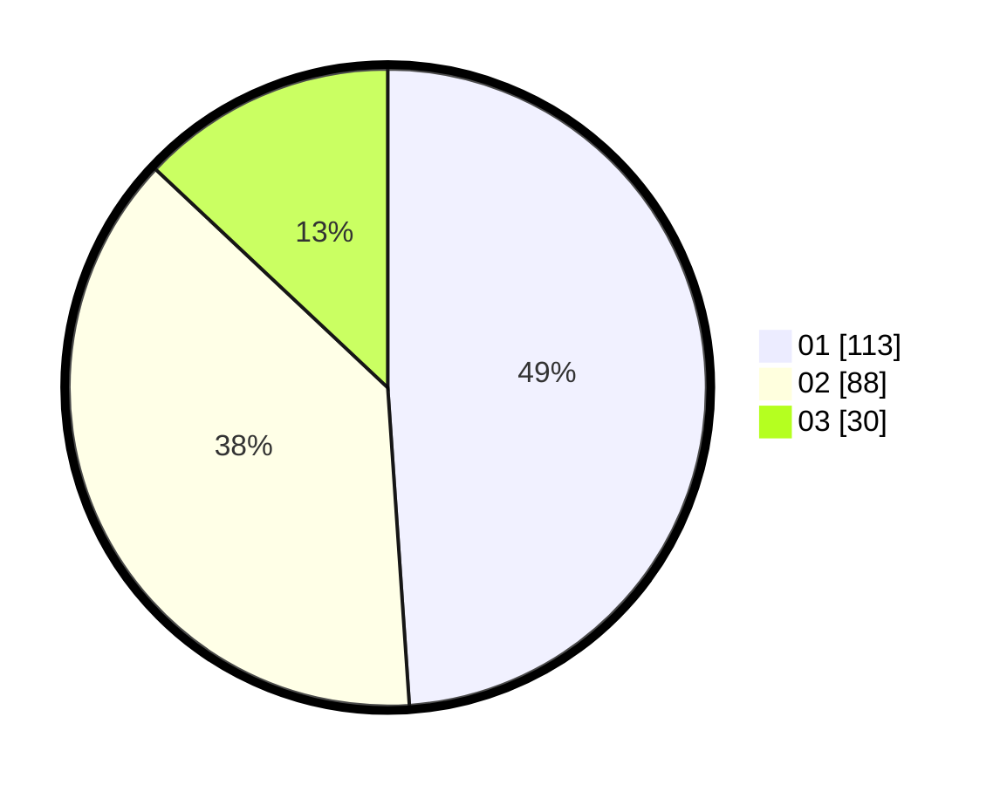

# Hasil

Hasil perolehan suara paslon dapat dilihat pada file paslon-01.txt, paslon-02.txt, dan paslon-03.txt.

Jika tidak ada, artinya data tersebut belum ada pada SIREKAP.

## Perolehan Suara

 * Paslon 01: **113**.
 * Paslon 02: **88**.
 * Paslon 03: **30**.

## Foto C Plano

https://sirekap-obj-formc.kpu.go.id/9a07/pemilu/ppwp/31/75/09/10/02/3175091002122-20240214-185912--dbe91aaa-13b5-47a7-90fa-2a8c739f3cab.jpg

https://sirekap-obj-formc.kpu.go.id/9a07/pemilu/ppwp/31/75/09/10/02/3175091002122-20240214-185932--777a0138-f5da-4d8f-9773-894e1eb37e7b.jpg

https://sirekap-obj-formc.kpu.go.id/9a07/pemilu/ppwp/31/75/09/10/02/3175091002122-20240214-190330--b9f4edaa-875f-4935-bd2d-3f47a0bc9a4b.jpg
