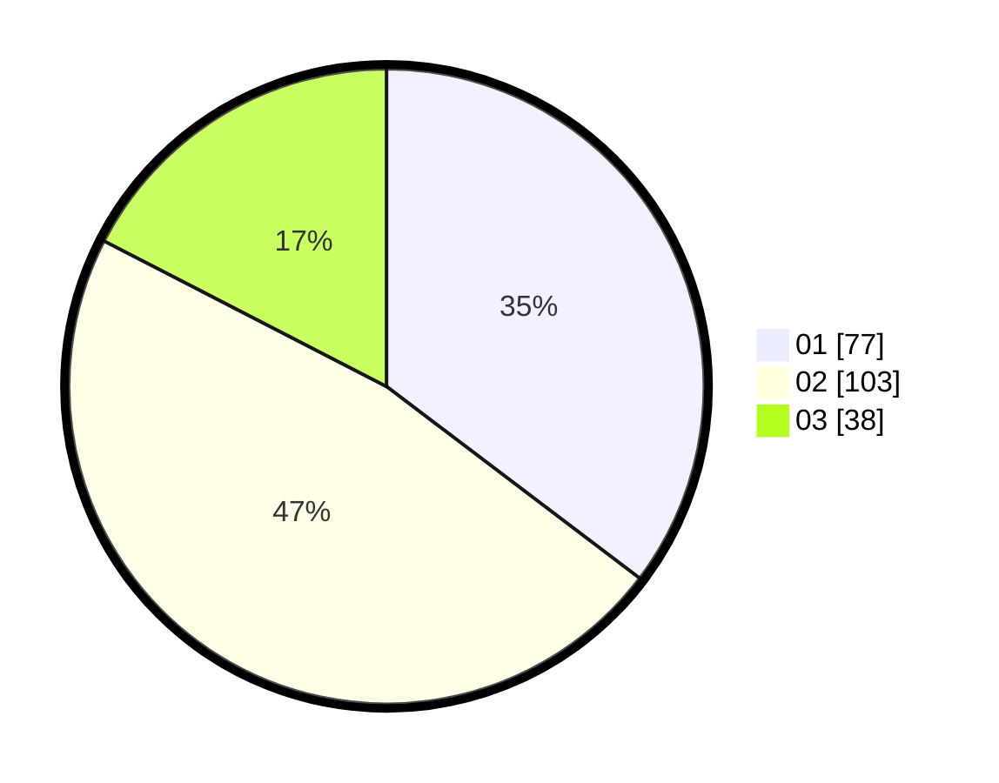

# Hasil

Hasil perolehan suara paslon dapat dilihat pada file paslon-01.txt, paslon-02.txt, dan paslon-03.txt.

Jika tidak ada, artinya data tersebut belum ada pada SIREKAP.

## Perolehan Suara

 * Paslon 01: **77**.
 * Paslon 02: **103**.
 * Paslon 03: **38**.

## Foto C Plano

https://sirekap-obj-formc.kpu.go.id/8df8/pemilu/ppwp/31/75/09/10/02/3175091002128-20240214-190656--2df2f552-191a-4374-91f9-4a35762920c7.jpg

https://sirekap-obj-formc.kpu.go.id/8df8/pemilu/ppwp/31/75/09/10/02/3175091002128-20240214-191611--e99c05cd-ef69-4c0f-8450-7eb8394a03d5.jpg

https://sirekap-obj-formc.kpu.go.id/8df8/pemilu/ppwp/31/75/09/10/02/3175091002128-20240214-191933--853c3dec-39f2-4ae3-a016-a9ee1759b45c.jpg

## DATA PEMILIH TETAP

Jumlah pemilih dalam DPT: **266**.
 * L: **124**.
 * P: **142**.

## DATA PENGGUNA HAK PILIH

Jumlah pengguna hak pilih dalam DPT: **221**.
 * L: **98**.
 * P: **123**.

Jumlah pengguna hak pilih dalam DPTb: **0**.
 * L: **0**.
 * P: **0**.

Jumlah pengguna hak pilih dalam DPK: **0**.
 * L: **0**.
 * P: **0**.

Jumlah pengguna hak pilih: **221**.
 * L: **98**.
 * P: **123**.

## JUMLAH SUARA SAH DAN TIDAK SAH

JUMLAH SELURUH SUARA SAH: **218**.

JUMLAH SUARA TIDAK SAH: **3**.

JUMLAH SELURUH SUARA SAH DAN SUARA TIDAK SAH: **221**.
