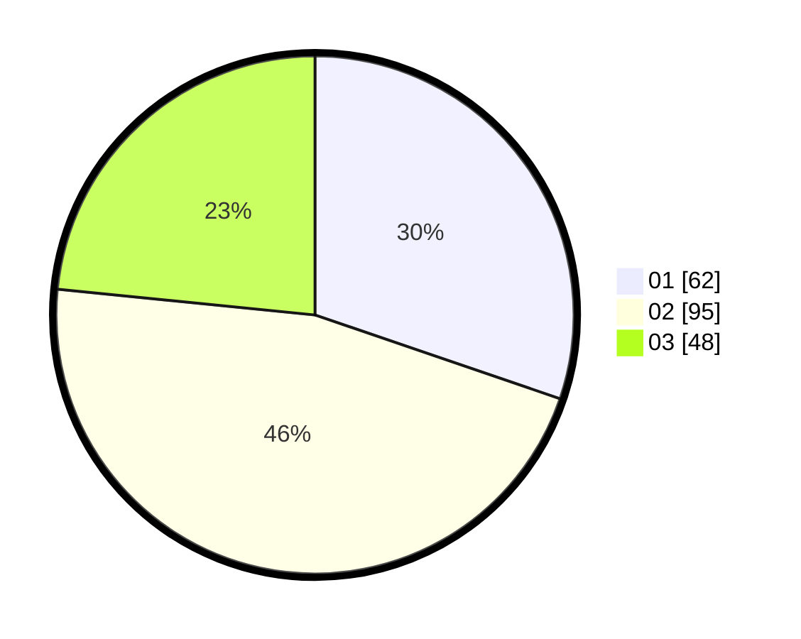

# Hasil

Hasil perolehan suara paslon dapat dilihat pada file paslon-01.txt, paslon-02.txt, dan paslon-03.txt.

Jika tidak ada, artinya data tersebut belum ada pada SIREKAP.

## Perolehan Suara

 * Paslon 01: **62**.
 * Paslon 02: **95**.
 * Paslon 03: **48**.

## Foto C Plano

https://sirekap-obj-formc.kpu.go.id/64d9/pemilu/ppwp/31/75/09/10/02/3175091002134-20240216-041423--047f04c5-fa18-42b3-858f-f783dbbd6718.jpg

https://sirekap-obj-formc.kpu.go.id/64d9/pemilu/ppwp/31/75/09/10/02/3175091002134-20240216-041425--ad5af5fd-086f-466f-8aef-8c986b8e8c9e.jpg

https://sirekap-obj-formc.kpu.go.id/64d9/pemilu/ppwp/31/75/09/10/02/3175091002134-20240216-041424--a591fdad-4690-4d9f-a0f5-6fb8a837d3a3.jpg

## DATA PEMILIH TETAP

Jumlah pemilih dalam DPT: **247**.
 * L: **114**.
 * P: **133**.

## DATA PENGGUNA HAK PILIH

Jumlah pengguna hak pilih dalam DPT: **206**.
 * L: **90**.
 * P: **116**.

Jumlah pengguna hak pilih dalam DPTb: **0**.
 * L: **0**.
 * P: **0**.

Jumlah pengguna hak pilih dalam DPK: **0**.
 * L: **0**.
 * P: **0**.

Jumlah pengguna hak pilih: **206**.
 * L: **90**.
 * P: **116**.

## JUMLAH SUARA SAH DAN TIDAK SAH

JUMLAH SELURUH SUARA SAH: **205**.

JUMLAH SUARA TIDAK SAH: **1**.

JUMLAH SELURUH SUARA SAH DAN SUARA TIDAK SAH: **206**.
