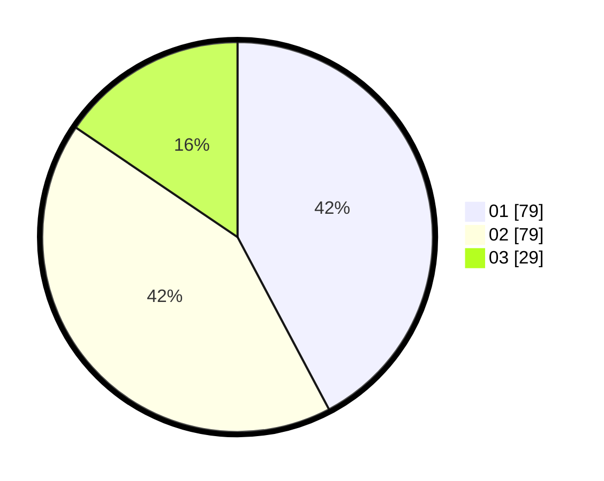

# Hasil

Hasil perolehan suara paslon dapat dilihat pada file paslon-01.txt, paslon-02.txt, dan paslon-03.txt.

Jika tidak ada, artinya data tersebut belum ada pada SIREKAP.

## Perolehan Suara

 * Paslon 01: **79**.
 * Paslon 02: **79**.
 * Paslon 03: **29**.

## Foto C Plano

https://sirekap-obj-formc.kpu.go.id/640c/pemilu/ppwp/31/75/09/10/02/3175091002148-20240214-190528--0eb9a3a3-c0df-4fa4-8f8e-e5f6b22d6cd4.jpg

https://sirekap-obj-formc.kpu.go.id/640c/pemilu/ppwp/31/75/09/10/02/3175091002148-20240214-191200--27e3aeaa-3b57-486c-8b6e-a48f372bf25b.jpg

https://sirekap-obj-formc.kpu.go.id/640c/pemilu/ppwp/31/75/09/10/02/3175091002148-20240214-191346--a5f7d1fd-1497-4bc4-bbda-d3aef5302ec0.jpg

## DATA PEMILIH TETAP

Jumlah pemilih dalam DPT: **253**.
 * L: **113**.
 * P: **140**.

## DATA PENGGUNA HAK PILIH

Jumlah pengguna hak pilih dalam DPT: **190**.
 * L: **81**.
 * P: **109**.

Jumlah pengguna hak pilih dalam DPTb: **0**.
 * L: **0**.
 * P: **0**.

Jumlah pengguna hak pilih dalam DPK: **0**.
 * L: **0**.
 * P: **0**.

Jumlah pengguna hak pilih: **190**.
 * L: **81**.
 * P: **109**.

## JUMLAH SUARA SAH DAN TIDAK SAH

JUMLAH SELURUH SUARA SAH: **187**.

JUMLAH SUARA TIDAK SAH: **3**.

JUMLAH SELURUH SUARA SAH DAN SUARA TIDAK SAH: **190**.
