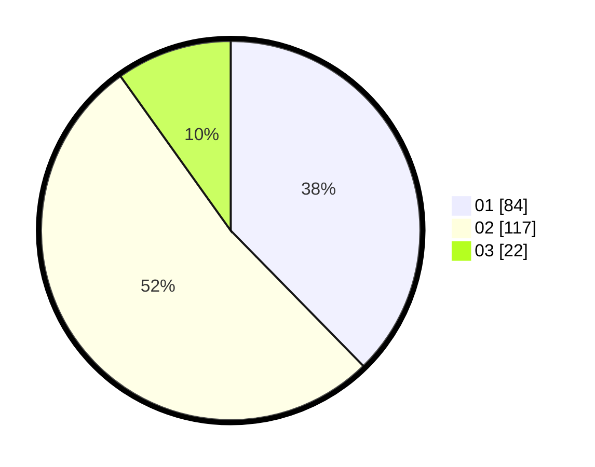

# Hasil

Hasil perolehan suara paslon dapat dilihat pada file paslon-01.txt, paslon-02.txt, dan paslon-03.txt.

Jika tidak ada, artinya data tersebut belum ada pada SIREKAP.

## Perolehan Suara

 * Paslon 01: **84**.
 * Paslon 02: **117**.
 * Paslon 03: **22**.

## Foto C Plano

https://sirekap-obj-formc.kpu.go.id/0cdd/pemilu/ppwp/31/75/09/10/02/3175091002149-20240214-191048--2902f0f9-4318-46ab-a426-3f2db7bd57a8.jpg

https://sirekap-obj-formc.kpu.go.id/0cdd/pemilu/ppwp/31/75/09/10/02/3175091002149-20240214-191416--8fbf0e33-b18f-4c6d-b707-482244353fde.jpg

https://sirekap-obj-formc.kpu.go.id/0cdd/pemilu/ppwp/31/75/09/10/02/3175091002149-20240214-191648--d3ddd3bf-3ec0-493b-83fe-ff88e14cf7c9.jpg

## DATA PEMILIH TETAP

Jumlah pemilih dalam DPT: **251**.
 * L: **130**.
 * P: **121**.

## DATA PENGGUNA HAK PILIH

Jumlah pengguna hak pilih dalam DPT: **210**.
 * L: **108**.
 * P: **102**.

Jumlah pengguna hak pilih dalam DPTb: **0**.
 * L: **0**.
 * P: **0**.

Jumlah pengguna hak pilih dalam DPK: **14**.
 * L: **7**.
 * P: **7**.

Jumlah pengguna hak pilih: **224**.
 * L: **115**.
 * P: **109**.

## JUMLAH SUARA SAH DAN TIDAK SAH

JUMLAH SELURUH SUARA SAH: **223**.

JUMLAH SUARA TIDAK SAH: **1**.

JUMLAH SELURUH SUARA SAH DAN SUARA TIDAK SAH: **224**.
