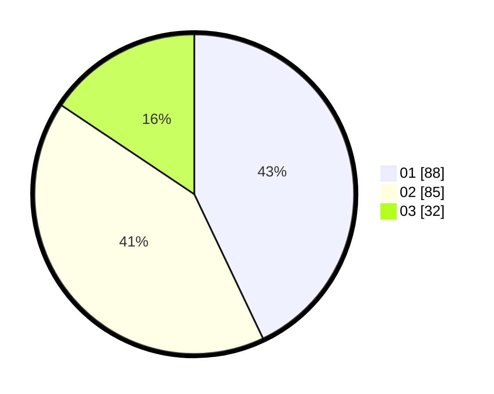

# Hasil

Hasil perolehan suara paslon dapat dilihat pada file paslon-01.txt, paslon-02.txt, dan paslon-03.txt.

Jika tidak ada, artinya data tersebut belum ada pada SIREKAP.

## Perolehan Suara

 * Paslon 01: **88**.
 * Paslon 02: **85**.
 * Paslon 03: **32**.

## Foto C Plano

https://sirekap-obj-formc.kpu.go.id/348f/pemilu/ppwp/31/75/09/10/02/3175091002153-20240214-205202--43a744c6-3086-43e0-90b4-0dd5239f0c93.jpg

https://sirekap-obj-formc.kpu.go.id/348f/pemilu/ppwp/31/75/09/10/02/3175091002153-20240214-205111--79e46cd7-fdaf-4088-935e-8b5a2e64b737.jpg

https://sirekap-obj-formc.kpu.go.id/348f/pemilu/ppwp/31/75/09/10/02/3175091002153-20240214-205246--56f43e76-a11d-4595-b449-bfe20af99b65.jpg
