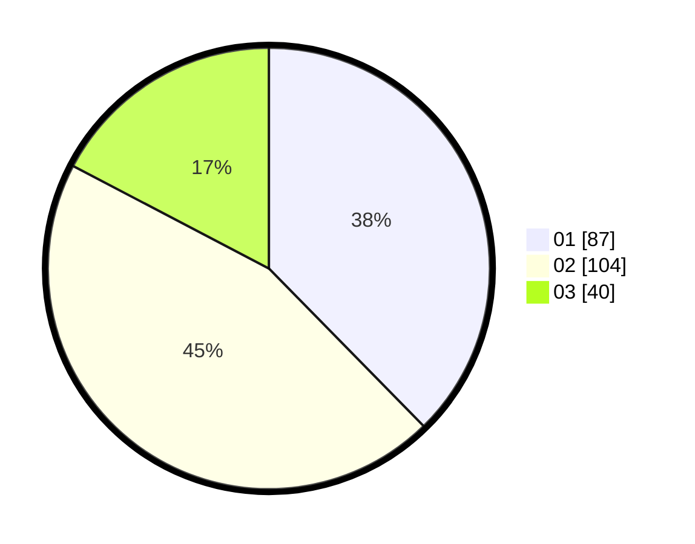

# Hasil

Hasil perolehan suara paslon dapat dilihat pada file paslon-01.txt, paslon-02.txt, dan paslon-03.txt.

Jika tidak ada, artinya data tersebut belum ada pada SIREKAP.

## Perolehan Suara

 * Paslon 01: **87**.
 * Paslon 02: **104**.
 * Paslon 03: **40**.

## Foto C Plano

https://sirekap-obj-formc.kpu.go.id/6083/pemilu/ppwp/31/75/09/10/02/3175091002154-20240214-185842--2e7def5e-c6e9-41f5-9819-1d5252e6fd5f.jpg

https://sirekap-obj-formc.kpu.go.id/6083/pemilu/ppwp/31/75/09/10/02/3175091002154-20240214-193212--44c7a9b1-bb04-4aa8-b0e3-a14a9d00c1f6.jpg

https://sirekap-obj-formc.kpu.go.id/6083/pemilu/ppwp/31/75/09/10/02/3175091002154-20240214-190844--303465d1-4748-4768-b0e3-269f06deed14.jpg

## DATA PEMILIH TETAP

Jumlah pemilih dalam DPT: **286**.
 * L: **141**.
 * P: **145**.

## DATA PENGGUNA HAK PILIH

Jumlah pengguna hak pilih dalam DPT: **236**.
 * L: **117**.
 * P: **119**.

Jumlah pengguna hak pilih dalam DPTb: **0**.
 * L: **0**.
 * P: **0**.

Jumlah pengguna hak pilih dalam DPK: **1**.
 * L: **0**.
 * P: **1**.

Jumlah pengguna hak pilih: **237**.
 * L: **117**.
 * P: **120**.

## JUMLAH SUARA SAH DAN TIDAK SAH

JUMLAH SELURUH SUARA SAH: **231**.

JUMLAH SUARA TIDAK SAH: **6**.

JUMLAH SELURUH SUARA SAH DAN SUARA TIDAK SAH: **237**.
