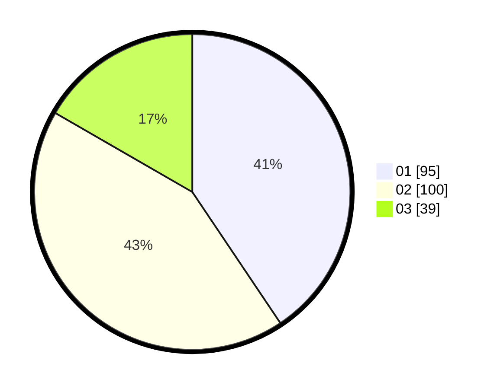

# Hasil

Hasil perolehan suara paslon dapat dilihat pada file paslon-01.txt, paslon-02.txt, dan paslon-03.txt.

Jika tidak ada, artinya data tersebut belum ada pada SIREKAP.

## Perolehan Suara

 * Paslon 01: **95**.
 * Paslon 02: **100**.
 * Paslon 03: **39**.

## Foto C Plano

https://sirekap-obj-formc.kpu.go.id/84a0/pemilu/ppwp/31/75/09/10/02/3175091002160-20240214-223129--f3a04b45-4783-4da3-84cc-a706ad190d9a.jpg

https://sirekap-obj-formc.kpu.go.id/84a0/pemilu/ppwp/31/75/09/10/02/3175091002160-20240214-223250--f1cfa812-098e-46c4-8257-1329db1958a0.jpg

https://sirekap-obj-formc.kpu.go.id/84a0/pemilu/ppwp/31/75/09/10/02/3175091002160-20240214-223429--92607789-6e73-4f1d-ace8-a26d61a5fb38.jpg

## DATA PEMILIH TETAP

Jumlah pemilih dalam DPT: **275**.
 * L: **131**.
 * P: **144**.

## DATA PENGGUNA HAK PILIH

Jumlah pengguna hak pilih dalam DPT: **231**.
 * L: **111**.
 * P: **120**.

Jumlah pengguna hak pilih dalam DPTb: **0**.
 * L: **0**.
 * P: **0**.

Jumlah pengguna hak pilih dalam DPK: **7**.
 * L: **2**.
 * P: **5**.

Jumlah pengguna hak pilih: **238**.
 * L: **113**.
 * P: **125**.

## JUMLAH SUARA SAH DAN TIDAK SAH

JUMLAH SELURUH SUARA SAH: **234**.

JUMLAH SUARA TIDAK SAH: **4**.

JUMLAH SELURUH SUARA SAH DAN SUARA TIDAK SAH: **238**.
