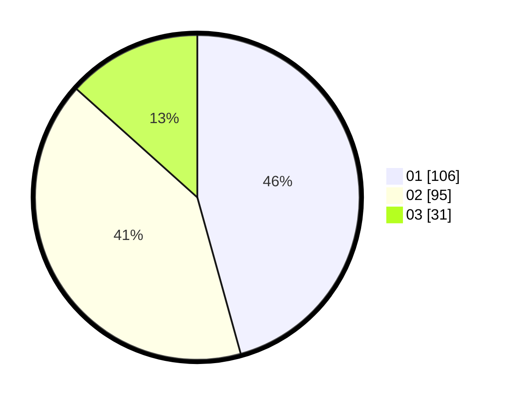

# Hasil

Hasil perolehan suara paslon dapat dilihat pada file paslon-01.txt, paslon-02.txt, dan paslon-03.txt.

Jika tidak ada, artinya data tersebut belum ada pada SIREKAP.

## Perolehan Suara

 * Paslon 01: **106**.
 * Paslon 02: **95**.
 * Paslon 03: **31**.

## Foto C Plano

https://sirekap-obj-formc.kpu.go.id/c082/pemilu/ppwp/31/75/09/10/02/3175091002161-20240214-214239--bc43adca-713c-40b5-8022-f5e4084357d5.jpg

https://sirekap-obj-formc.kpu.go.id/c082/pemilu/ppwp/31/75/09/10/02/3175091002161-20240214-214408--6b1a7396-1bb7-4d01-a6f9-fbf221baf438.jpg

https://sirekap-obj-formc.kpu.go.id/c082/pemilu/ppwp/31/75/09/10/02/3175091002161-20240214-214439--9dc20933-2299-41a3-b687-0367878b343d.jpg

## DATA PEMILIH TETAP

Jumlah pemilih dalam DPT: **263**.
 * L: **129**.
 * P: **134**.

## DATA PENGGUNA HAK PILIH

Jumlah pengguna hak pilih dalam DPT: **236**.
 * L: **117**.
 * P: **119**.

Jumlah pengguna hak pilih dalam DPTb: **0**.
 * L: **0**.
 * P: **0**.

Jumlah pengguna hak pilih dalam DPK: **0**.
 * L: **0**.
 * P: **0**.

Jumlah pengguna hak pilih: **236**.
 * L: **117**.
 * P: **119**.

## JUMLAH SUARA SAH DAN TIDAK SAH

JUMLAH SELURUH SUARA SAH: **232**.

JUMLAH SUARA TIDAK SAH: **4**.

JUMLAH SELURUH SUARA SAH DAN SUARA TIDAK SAH: **236**.
