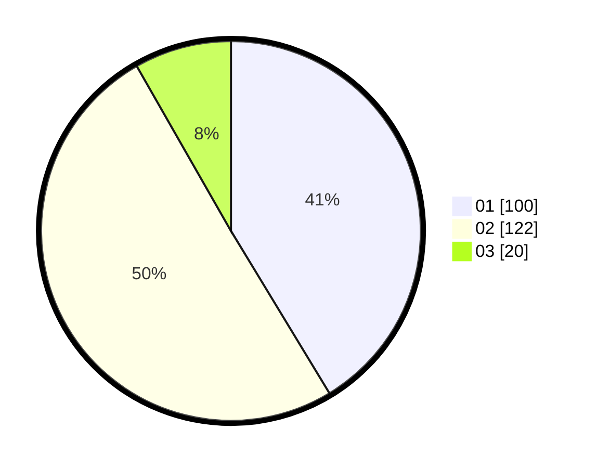

# Hasil

Hasil perolehan suara paslon dapat dilihat pada file paslon-01.txt, paslon-02.txt, dan paslon-03.txt.

Jika tidak ada, artinya data tersebut belum ada pada SIREKAP.

## Perolehan Suara

 * Paslon 01: **100**.
 * Paslon 02: **122**.
 * Paslon 03: **20**.

## Foto C Plano

https://sirekap-obj-formc.kpu.go.id/9741/pemilu/ppwp/31/75/09/10/02/3175091002163-20240214-155215--ab948204-ded9-4c32-8cb4-2f4c0bcd0de7.jpg

https://sirekap-obj-formc.kpu.go.id/9741/pemilu/ppwp/31/75/09/10/02/3175091002163-20240214-155231--e8778976-e777-4ade-be84-0dcd8c58cfcd.jpg

https://sirekap-obj-formc.kpu.go.id/9741/pemilu/ppwp/31/75/09/10/02/3175091002163-20240214-155247--11cfa29e-d407-4f36-aa02-d61047680cca.jpg

## DATA PEMILIH TETAP

Jumlah pemilih dalam DPT: **274**.
 * L: **135**.
 * P: **139**.

## DATA PENGGUNA HAK PILIH

Jumlah pengguna hak pilih dalam DPT: **231**.
 * L: **109**.
 * P: **122**.

Jumlah pengguna hak pilih dalam DPTb: **12**.
 * L: **6**.
 * P: **6**.

Jumlah pengguna hak pilih dalam DPK: **5**.
 * L: **3**.
 * P: **2**.

Jumlah pengguna hak pilih: **248**.
 * L: **118**.
 * P: **130**.

## JUMLAH SUARA SAH DAN TIDAK SAH

JUMLAH SELURUH SUARA SAH: **242**.

JUMLAH SUARA TIDAK SAH: **6**.

JUMLAH SELURUH SUARA SAH DAN SUARA TIDAK SAH: **248**.
