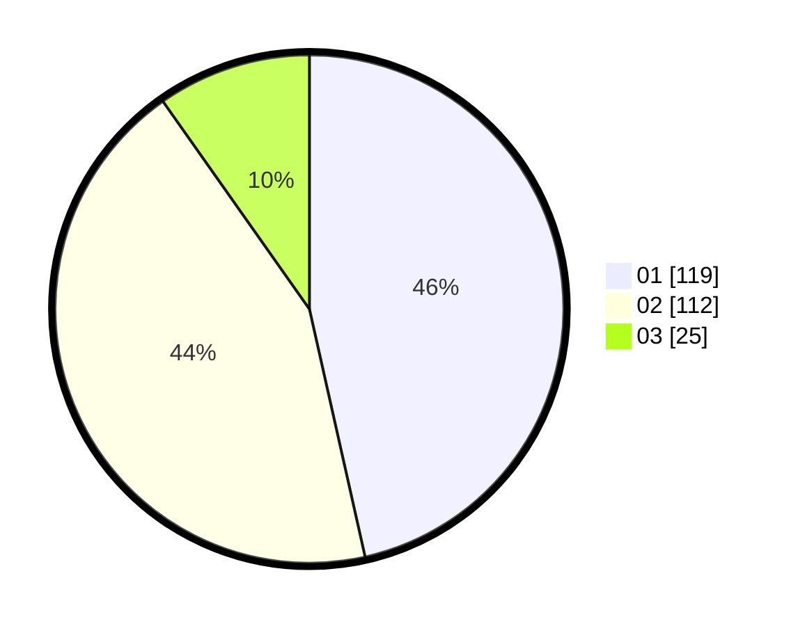

# Hasil

Hasil perolehan suara paslon dapat dilihat pada file paslon-01.txt, paslon-02.txt, dan paslon-03.txt.

Jika tidak ada, artinya data tersebut belum ada pada SIREKAP.

## Perolehan Suara

 * Paslon 01: **119**.
 * Paslon 02: **112**.
 * Paslon 03: **25**.

## Foto C Plano

https://sirekap-obj-formc.kpu.go.id/d492/pemilu/ppwp/31/75/09/10/02/3175091002164-20240216-130740--30a87819-49be-46a6-aa1c-da9d27210d10.jpg

https://sirekap-obj-formc.kpu.go.id/d492/pemilu/ppwp/31/75/09/10/02/3175091002164-20240214-155831--56add4e8-7e2d-4fad-93c3-407628500e81.jpg

https://sirekap-obj-formc.kpu.go.id/d492/pemilu/ppwp/31/75/09/10/02/3175091002164-20240214-155039--510c3edc-f1e1-4d90-a43e-d41eeade1306.jpg

## DATA PEMILIH TETAP

Jumlah pemilih dalam DPT: **282**.
 * L: **137**.
 * P: **145**.

## DATA PENGGUNA HAK PILIH

Jumlah pengguna hak pilih dalam DPT: **252**.
 * L: **122**.
 * P: **130**.

Jumlah pengguna hak pilih dalam DPTb: **3**.
 * L: **1**.
 * P: **2**.

Jumlah pengguna hak pilih dalam DPK: **3**.
 * L: **2**.
 * P: **1**.

Jumlah pengguna hak pilih: **258**.
 * L: **125**.
 * P: **133**.

## JUMLAH SUARA SAH DAN TIDAK SAH

JUMLAH SELURUH SUARA SAH: **256**.

JUMLAH SUARA TIDAK SAH: **2**.

JUMLAH SELURUH SUARA SAH DAN SUARA TIDAK SAH: **258**.
