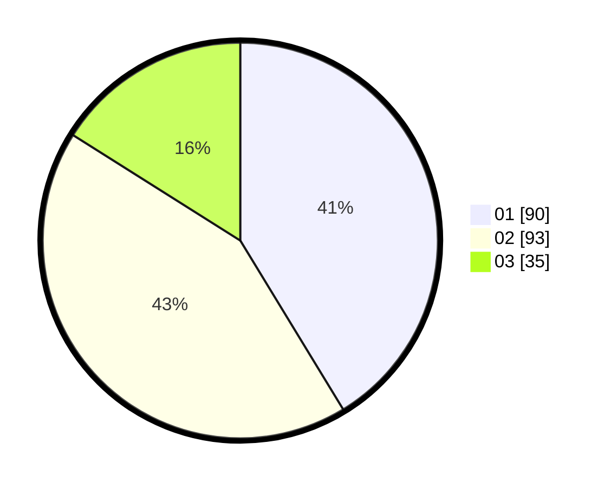

# Hasil

Hasil perolehan suara paslon dapat dilihat pada file paslon-01.txt, paslon-02.txt, dan paslon-03.txt.

Jika tidak ada, artinya data tersebut belum ada pada SIREKAP.

## Perolehan Suara

 * Paslon 01: **90**.
 * Paslon 02: **93**.
 * Paslon 03: **35**.

## Foto C Plano

https://sirekap-obj-formc.kpu.go.id/d902/pemilu/ppwp/31/75/09/10/02/3175091002171-20240214-184630--6bd7a59d-abf9-4289-95f2-914380bb3ee4.jpg

https://sirekap-obj-formc.kpu.go.id/d902/pemilu/ppwp/31/75/09/10/02/3175091002171-20240214-184744--6fce353e-b786-4aa3-afd2-dfd31f40769b.jpg

https://sirekap-obj-formc.kpu.go.id/d902/pemilu/ppwp/31/75/09/10/02/3175091002171-20240214-184521--c756e071-e43a-4d68-8e61-73b63f8c1065.jpg

## DATA PEMILIH TETAP

Jumlah pemilih dalam DPT: **251**.
 * L: **112**.
 * P: **139**.

## DATA PENGGUNA HAK PILIH

Jumlah pengguna hak pilih dalam DPT: **214**.
 * L: **98**.
 * P: **116**.

Jumlah pengguna hak pilih dalam DPTb: **4**.
 * L: **1**.
 * P: **3**.

Jumlah pengguna hak pilih dalam DPK: **2**.
 * L: **1**.
 * P: **1**.

Jumlah pengguna hak pilih: **220**.
 * L: **100**.
 * P: **120**.

## JUMLAH SUARA SAH DAN TIDAK SAH

JUMLAH SELURUH SUARA SAH: **218**.

JUMLAH SUARA TIDAK SAH: **2**.

JUMLAH SELURUH SUARA SAH DAN SUARA TIDAK SAH: **220**.
