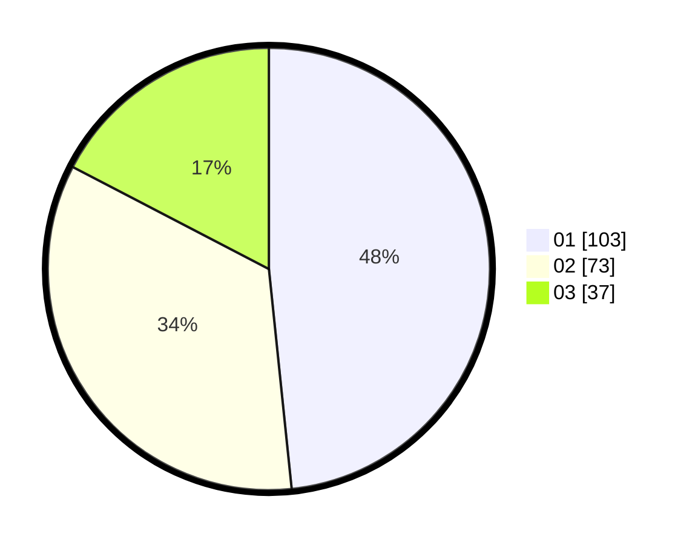

# Hasil

Hasil perolehan suara paslon dapat dilihat pada file paslon-01.txt, paslon-02.txt, dan paslon-03.txt.

Jika tidak ada, artinya data tersebut belum ada pada SIREKAP.

## Perolehan Suara

 * Paslon 01: **103**.
 * Paslon 02: **73**.
 * Paslon 03: **37**.

## Foto C Plano

https://sirekap-obj-formc.kpu.go.id/c8c6/pemilu/ppwp/31/75/09/10/02/3175091002175-20240214-211036--e7e7c8e7-85ad-49cc-b523-0870de0d0883.jpg

https://sirekap-obj-formc.kpu.go.id/c8c6/pemilu/ppwp/31/75/09/10/02/3175091002175-20240214-155054--2c5e79ea-8459-4c61-a655-520e1de6914e.jpg

https://sirekap-obj-formc.kpu.go.id/c8c6/pemilu/ppwp/31/75/09/10/02/3175091002175-20240214-141631--053f9c45-a9c7-42f0-9a17-7598e05db366.jpg
