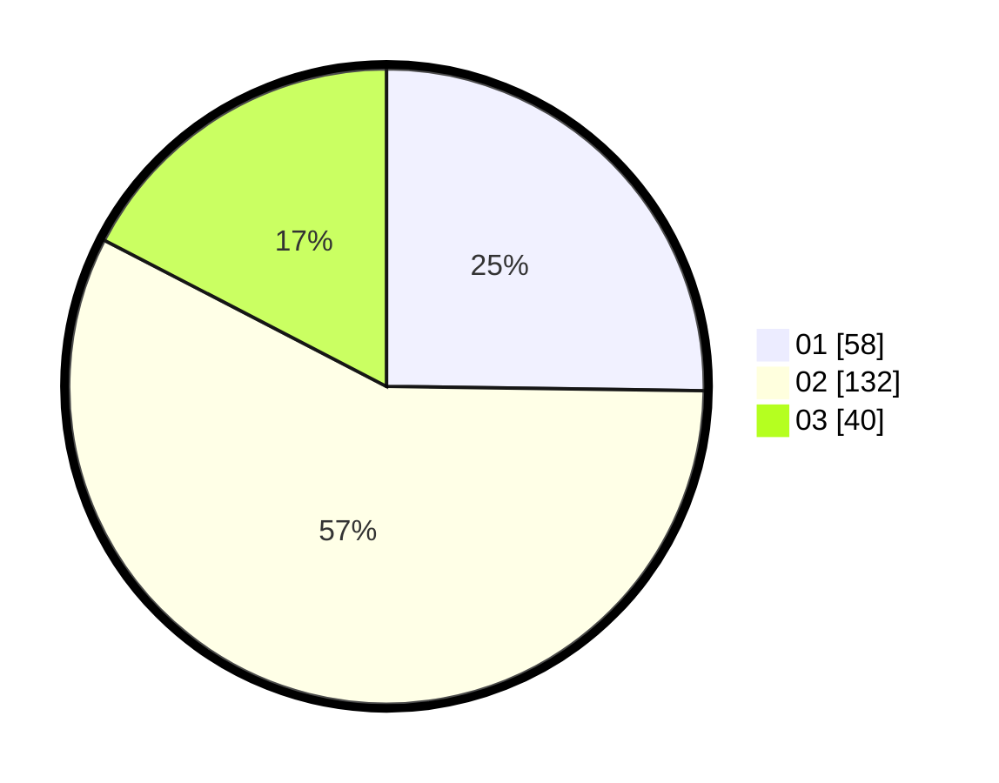

# Hasil

Hasil perolehan suara paslon dapat dilihat pada file paslon-01.txt, paslon-02.txt, dan paslon-03.txt.

Jika tidak ada, artinya data tersebut belum ada pada SIREKAP.

## Perolehan Suara

 * Paslon 01: **58**.
 * Paslon 02: **132**.
 * Paslon 03: **40**.

## Foto C Plano

https://sirekap-obj-formc.kpu.go.id/922b/pemilu/ppwp/31/75/09/10/02/3175091002181-20240215-212013--dbbd4927-e1d6-45f4-b6a6-cd8b37794df8.jpg

https://sirekap-obj-formc.kpu.go.id/922b/pemilu/ppwp/31/75/09/10/02/3175091002181-20240214-162221--9462c5d8-4cd5-463c-ba26-c720ed8e8aa6.jpg

https://sirekap-obj-formc.kpu.go.id/922b/pemilu/ppwp/31/75/09/10/02/3175091002181-20240214-162225--f8c2dfb1-2cdf-474b-81f4-ace711c2c136.jpg

## DATA PEMILIH TETAP

Jumlah pemilih dalam DPT: **291**.
 * L: **152**.
 * P: **139**.

## DATA PENGGUNA HAK PILIH

Jumlah pengguna hak pilih dalam DPT: **234**.
 * L: **118**.
 * P: **116**.

Jumlah pengguna hak pilih dalam DPTb: **1**.
 * L: **1**.
 * P: **0**.

Jumlah pengguna hak pilih dalam DPK: **0**.
 * L: **0**.
 * P: **0**.

Jumlah pengguna hak pilih: **235**.
 * L: **119**.
 * P: **116**.

## JUMLAH SUARA SAH DAN TIDAK SAH

JUMLAH SELURUH SUARA SAH: **230**.

JUMLAH SUARA TIDAK SAH: **5**.

JUMLAH SELURUH SUARA SAH DAN SUARA TIDAK SAH: **235**.
