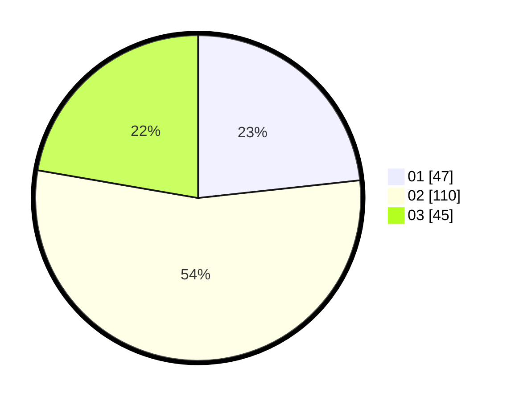

# Hasil

Hasil perolehan suara paslon dapat dilihat pada file paslon-01.txt, paslon-02.txt, dan paslon-03.txt.

Jika tidak ada, artinya data tersebut belum ada pada SIREKAP.

## Perolehan Suara

 * Paslon 01: **47**.
 * Paslon 02: **110**.
 * Paslon 03: **45**.

## Foto C Plano

https://sirekap-obj-formc.kpu.go.id/c1b7/pemilu/ppwp/31/75/09/10/02/3175091002183-20240214-195346--0bbef9d5-6ab4-473a-9b43-324ca97ef05c.jpg

https://sirekap-obj-formc.kpu.go.id/c1b7/pemilu/ppwp/31/75/09/10/02/3175091002183-20240214-201620--471089b3-e194-4f71-ad55-c2225a5126ad.jpg

https://sirekap-obj-formc.kpu.go.id/c1b7/pemilu/ppwp/31/75/09/10/02/3175091002183-20240214-195546--c0411da3-bd28-49ba-9ea9-f11f90fde25a.jpg

## DATA PEMILIH TETAP

Jumlah pemilih dalam DPT: **248**.
 * L: **130**.
 * P: **118**.

## DATA PENGGUNA HAK PILIH

Jumlah pengguna hak pilih dalam DPT: **203**.
 * L: **105**.
 * P: **98**.

Jumlah pengguna hak pilih dalam DPTb: **1**.
 * L: **1**.
 * P: **0**.

Jumlah pengguna hak pilih dalam DPK: **2**.
 * L: **1**.
 * P: **1**.

Jumlah pengguna hak pilih: **206**.
 * L: **107**.
 * P: **99**.

## JUMLAH SUARA SAH DAN TIDAK SAH

JUMLAH SELURUH SUARA SAH: **202**.

JUMLAH SUARA TIDAK SAH: **4**.

JUMLAH SELURUH SUARA SAH DAN SUARA TIDAK SAH: **206**.
