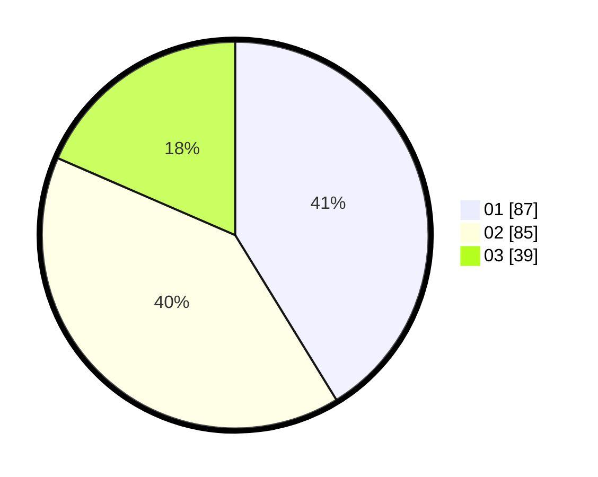

# Hasil

Hasil perolehan suara paslon dapat dilihat pada file paslon-01.txt, paslon-02.txt, dan paslon-03.txt.

Jika tidak ada, artinya data tersebut belum ada pada SIREKAP.

## Perolehan Suara

 * Paslon 01: **87**.
 * Paslon 02: **85**.
 * Paslon 03: **39**.

## Foto C Plano

https://sirekap-obj-formc.kpu.go.id/db86/pemilu/ppwp/31/75/09/10/02/3175091002185-20240214-203741--99ed4b29-c946-4545-9e3c-d6b493c06867.jpg

https://sirekap-obj-formc.kpu.go.id/db86/pemilu/ppwp/31/75/09/10/02/3175091002185-20240214-203906--53320acf-519f-4b73-8dc1-703db6f47429.jpg

https://sirekap-obj-formc.kpu.go.id/db86/pemilu/ppwp/31/75/09/10/02/3175091002185-20240214-203956--ab61ecfe-0dd3-4c8d-92bb-2f146112b4b9.jpg

## DATA PEMILIH TETAP

Jumlah pemilih dalam DPT: **249**.
 * L: **125**.
 * P: **124**.

## DATA PENGGUNA HAK PILIH

Jumlah pengguna hak pilih dalam DPT: **210**.
 * L: **100**.
 * P: **110**.

Jumlah pengguna hak pilih dalam DPTb: **0**.
 * L: **0**.
 * P: **0**.

Jumlah pengguna hak pilih dalam DPK: **5**.
 * L: **2**.
 * P: **3**.

Jumlah pengguna hak pilih: **215**.
 * L: **102**.
 * P: **113**.

## JUMLAH SUARA SAH DAN TIDAK SAH

JUMLAH SELURUH SUARA SAH: **211**.

JUMLAH SUARA TIDAK SAH: **4**.

JUMLAH SELURUH SUARA SAH DAN SUARA TIDAK SAH: **215**.
