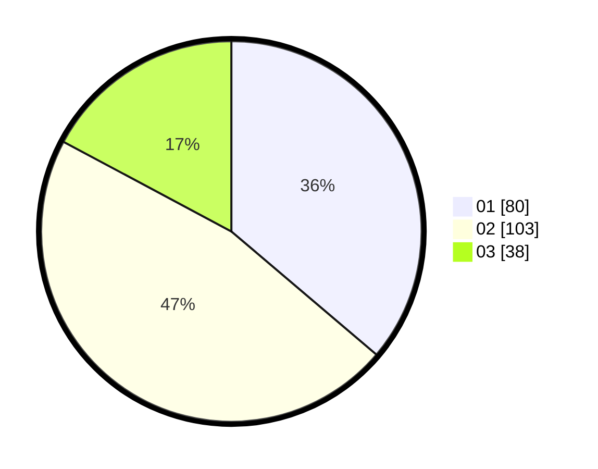

# Hasil

Hasil perolehan suara paslon dapat dilihat pada file paslon-01.txt, paslon-02.txt, dan paslon-03.txt.

Jika tidak ada, artinya data tersebut belum ada pada SIREKAP.

## Perolehan Suara

 * Paslon 01: **80**.
 * Paslon 02: **103**.
 * Paslon 03: **38**.

## Foto C Plano

https://sirekap-obj-formc.kpu.go.id/f795/pemilu/ppwp/31/75/09/10/02/3175091002187-20240214-204117--12ee2276-d4cc-4f9a-a094-b1ba1d4fe5b2.jpg

https://sirekap-obj-formc.kpu.go.id/f795/pemilu/ppwp/31/75/09/10/02/3175091002187-20240214-204141--76a1f7a8-4b29-4b76-b92e-73db54841c00.jpg

https://sirekap-obj-formc.kpu.go.id/f795/pemilu/ppwp/31/75/09/10/02/3175091002187-20240214-204157--935acf73-de69-4d62-90e6-7fe7f99210e6.jpg

## DATA PEMILIH TETAP

Jumlah pemilih dalam DPT: **261**.
 * L: **129**.
 * P: **132**.

## DATA PENGGUNA HAK PILIH

Jumlah pengguna hak pilih dalam DPT: **220**.
 * L: **104**.
 * P: **116**.

Jumlah pengguna hak pilih dalam DPTb: **3**.
 * L: **0**.
 * P: **3**.

Jumlah pengguna hak pilih dalam DPK: **1**.
 * L: **0**.
 * P: **1**.

Jumlah pengguna hak pilih: **224**.
 * L: **104**.
 * P: **120**.

## JUMLAH SUARA SAH DAN TIDAK SAH

JUMLAH SELURUH SUARA SAH: **221**.

JUMLAH SUARA TIDAK SAH: **3**.

JUMLAH SELURUH SUARA SAH DAN SUARA TIDAK SAH: **224**.
