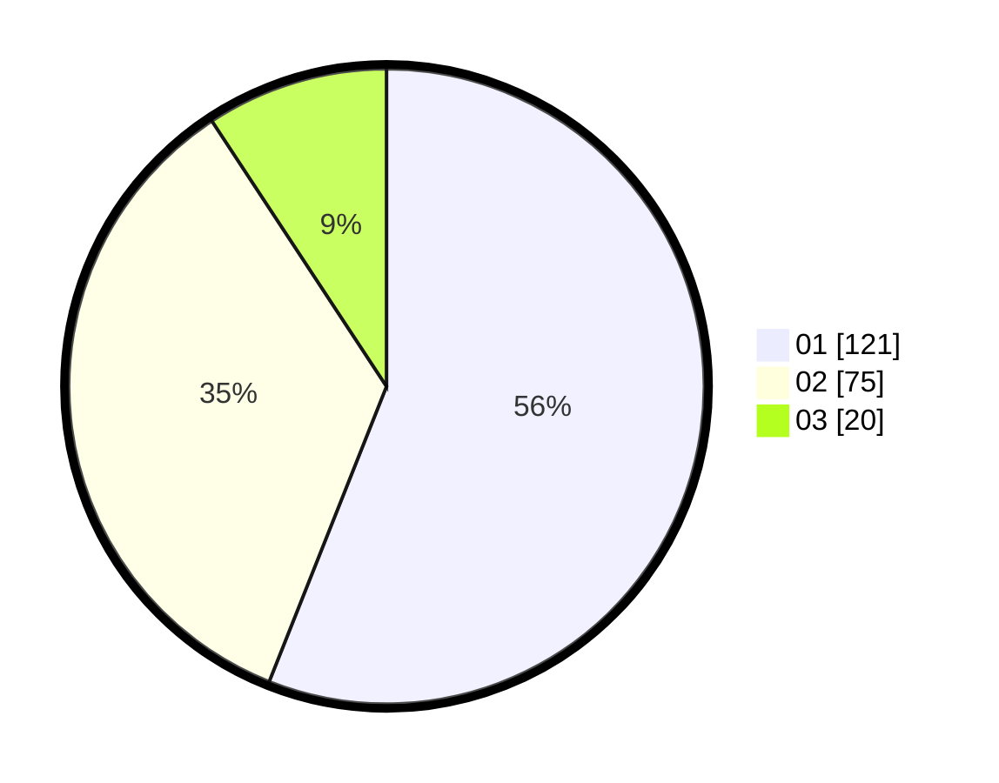

# Hasil

Hasil perolehan suara paslon dapat dilihat pada file paslon-01.txt, paslon-02.txt, dan paslon-03.txt.

Jika tidak ada, artinya data tersebut belum ada pada SIREKAP.

## Perolehan Suara

 * Paslon 01: **121**.
 * Paslon 02: **75**.
 * Paslon 03: **20**.

## Foto C Plano

https://sirekap-obj-formc.kpu.go.id/0264/pemilu/ppwp/31/75/09/10/02/3175091002188-20240214-185517--7156dc53-beb2-4f66-98e0-9a352bcf2e81.jpg

https://sirekap-obj-formc.kpu.go.id/0264/pemilu/ppwp/31/75/09/10/02/3175091002188-20240214-185524--5e9b4767-f8ca-47b1-81d4-50c622634a3e.jpg

https://sirekap-obj-formc.kpu.go.id/0264/pemilu/ppwp/31/75/09/10/02/3175091002188-20240214-185529--1120d03e-db45-49fb-a3fe-70c100f38dda.jpg

## DATA PEMILIH TETAP

Jumlah pemilih dalam DPT: **253**.
 * L: **118**.
 * P: **135**.

## DATA PENGGUNA HAK PILIH

Jumlah pengguna hak pilih dalam DPT: **220**.
 * L: **99**.
 * P: **121**.

Jumlah pengguna hak pilih dalam DPTb: **3**.
 * L: **1**.
 * P: **2**.

Jumlah pengguna hak pilih dalam DPK: **0**.
 * L: **0**.
 * P: **0**.

Jumlah pengguna hak pilih: **223**.
 * L: **100**.
 * P: **123**.

## JUMLAH SUARA SAH DAN TIDAK SAH

JUMLAH SELURUH SUARA SAH: **216**.

JUMLAH SUARA TIDAK SAH: **7**.

JUMLAH SELURUH SUARA SAH DAN SUARA TIDAK SAH: **223**.
