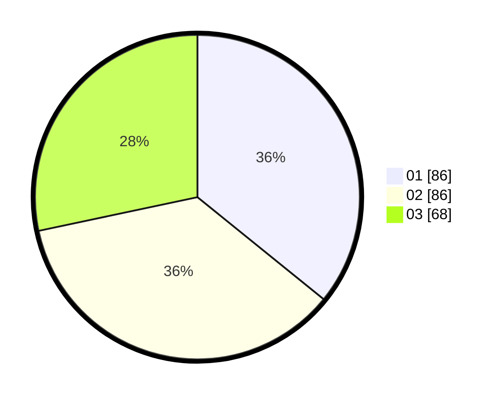

# Hasil

Hasil perolehan suara paslon dapat dilihat pada file paslon-01.txt, paslon-02.txt, dan paslon-03.txt.

Jika tidak ada, artinya data tersebut belum ada pada SIREKAP.

## Perolehan Suara

 * Paslon 01: **86**.
 * Paslon 02: **86**.
 * Paslon 03: **68**.

## Foto C Plano

https://sirekap-obj-formc.kpu.go.id/9b87/pemilu/ppwp/31/75/09/10/02/3175091002195-20240214-155718--b61a0620-a56b-4dd4-b658-d55083437897.jpg

https://sirekap-obj-formc.kpu.go.id/9b87/pemilu/ppwp/31/75/09/10/02/3175091002195-20240214-155602--2f80150c-c9bc-435a-9241-7231fbd4aa55.jpg

https://sirekap-obj-formc.kpu.go.id/9b87/pemilu/ppwp/31/75/09/10/02/3175091002195-20240214-193902--838cf912-6636-49d0-96b8-bc3f139e6f01.jpg

## DATA PEMILIH TETAP

Jumlah pemilih dalam DPT: **287**.
 * L: **134**.
 * P: **153**.

## DATA PENGGUNA HAK PILIH

Jumlah pengguna hak pilih dalam DPT: **229**.
 * L: **106**.
 * P: **123**.

Jumlah pengguna hak pilih dalam DPTb: **10**.
 * L: **2**.
 * P: **8**.

Jumlah pengguna hak pilih dalam DPK: **7**.
 * L: **2**.
 * P: **5**.

Jumlah pengguna hak pilih: **246**.
 * L: **110**.
 * P: **136**.

## JUMLAH SUARA SAH DAN TIDAK SAH

JUMLAH SELURUH SUARA SAH: **240**.

JUMLAH SUARA TIDAK SAH: **6**.

JUMLAH SELURUH SUARA SAH DAN SUARA TIDAK SAH: **246**.
