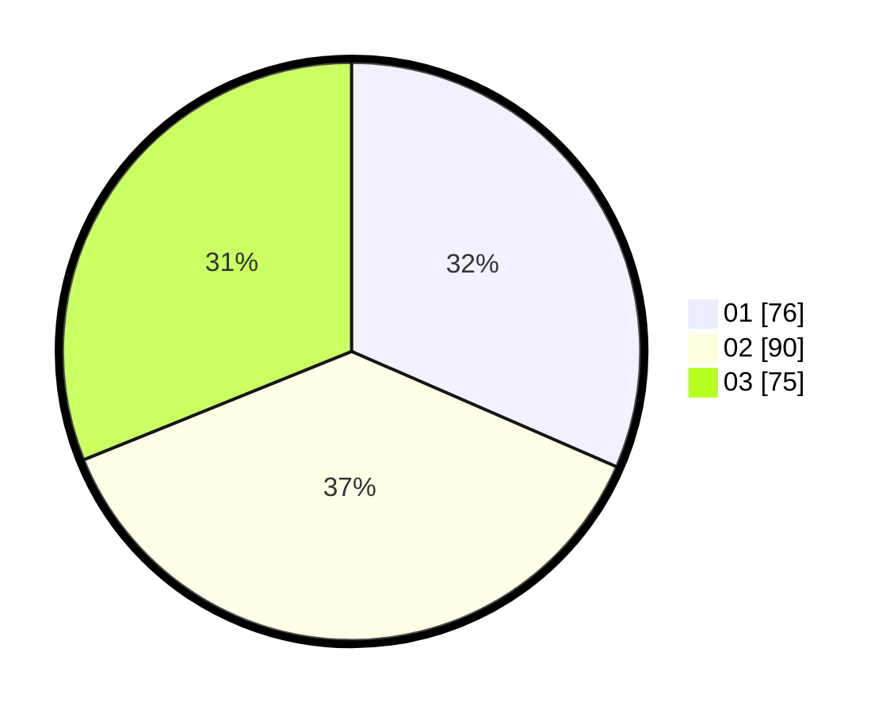

# Hasil

Hasil perolehan suara paslon dapat dilihat pada file paslon-01.txt, paslon-02.txt, dan paslon-03.txt.

Jika tidak ada, artinya data tersebut belum ada pada SIREKAP.

## Perolehan Suara

 * Paslon 01: **76**.
 * Paslon 02: **90**.
 * Paslon 03: **75**.

## Foto C Plano

https://sirekap-obj-formc.kpu.go.id/f520/pemilu/ppwp/31/75/09/10/02/3175091002201-20240214-162222--f3f15235-78d0-4ea1-8391-4d9e59389f49.jpg

https://sirekap-obj-formc.kpu.go.id/f520/pemilu/ppwp/31/75/09/10/02/3175091002201-20240214-162231--db107c39-1252-4637-8f97-5e091c035745.jpg

https://sirekap-obj-formc.kpu.go.id/f520/pemilu/ppwp/31/75/09/10/02/3175091002201-20240214-162243--c027b53e-d0e9-483b-8d41-e0968d4c5723.jpg

## DATA PEMILIH TETAP

Jumlah pemilih dalam DPT: **272**.
 * L: **131**.
 * P: **141**.

## DATA PENGGUNA HAK PILIH

Jumlah pengguna hak pilih dalam DPT: **215**.
 * L: **102**.
 * P: **113**.

Jumlah pengguna hak pilih dalam DPTb: **17**.
 * L: **9**.
 * P: **8**.

Jumlah pengguna hak pilih dalam DPK: **9**.
 * L: **6**.
 * P: **3**.

Jumlah pengguna hak pilih: **241**.
 * L: **117**.
 * P: **124**.

## JUMLAH SUARA SAH DAN TIDAK SAH

JUMLAH SELURUH SUARA SAH: **241**.

JUMLAH SUARA TIDAK SAH: **0**.

JUMLAH SELURUH SUARA SAH DAN SUARA TIDAK SAH: **241**.
