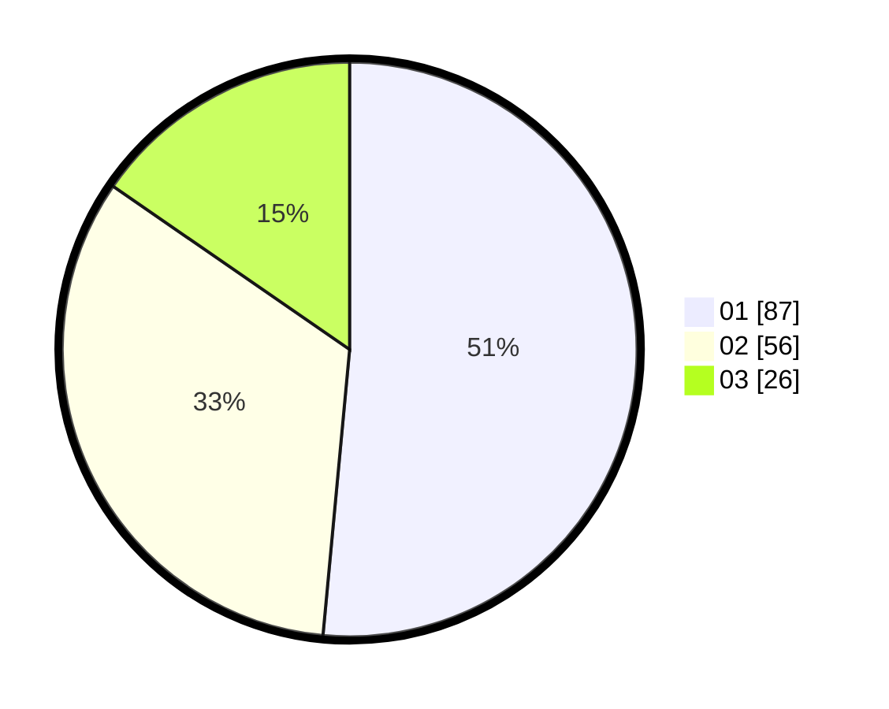

# Hasil

Hasil perolehan suara paslon dapat dilihat pada file paslon-01.txt, paslon-02.txt, dan paslon-03.txt.

Jika tidak ada, artinya data tersebut belum ada pada SIREKAP.

## Perolehan Suara

 * Paslon 01: **87**.
 * Paslon 02: **56**.
 * Paslon 03: **26**.

## Foto C Plano

https://sirekap-obj-formc.kpu.go.id/7567/pemilu/ppwp/31/75/09/10/02/3175091002222-20240216-165210--bbdcf9f0-5ee8-4f79-993f-99a8f185898c.jpg

https://sirekap-obj-formc.kpu.go.id/7567/pemilu/ppwp/31/75/09/10/02/3175091002222-20240216-170043--8ae186fc-2caa-42c9-b536-5364c471735d.jpg

https://sirekap-obj-formc.kpu.go.id/7567/pemilu/ppwp/31/75/09/10/02/3175091002222-20240216-170741--5a9f6fb0-993f-4e5e-8a23-bf0724b3776d.jpg

## DATA PEMILIH TETAP

Jumlah pemilih dalam DPT: **209**.
 * L: **95**.
 * P: **114**.

## DATA PENGGUNA HAK PILIH

Jumlah pengguna hak pilih dalam DPT: **168**.
 * L: **79**.
 * P: **89**.

Jumlah pengguna hak pilih dalam DPTb: **2**.
 * L: **1**.
 * P: **1**.

Jumlah pengguna hak pilih dalam DPK: **2**.
 * L: **0**.
 * P: **2**.

Jumlah pengguna hak pilih: **172**.
 * L: **80**.
 * P: **92**.

## JUMLAH SUARA SAH DAN TIDAK SAH

JUMLAH SELURUH SUARA SAH: **169**.

JUMLAH SUARA TIDAK SAH: **3**.

JUMLAH SELURUH SUARA SAH DAN SUARA TIDAK SAH: **172**.
