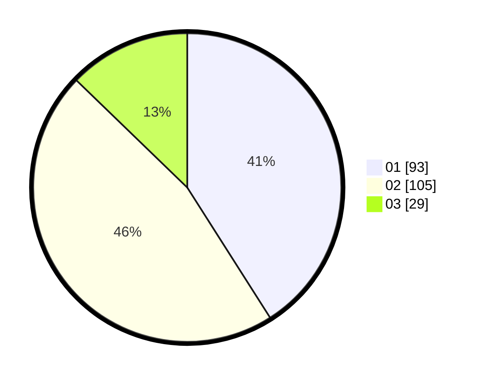

# Hasil

Hasil perolehan suara paslon dapat dilihat pada file paslon-01.txt, paslon-02.txt, dan paslon-03.txt.

Jika tidak ada, artinya data tersebut belum ada pada SIREKAP.

## Perolehan Suara

 * Paslon 01: **93**.
 * Paslon 02: **105**.
 * Paslon 03: **29**.

## Foto C Plano

https://sirekap-obj-formc.kpu.go.id/14c4/pemilu/ppwp/31/75/09/10/03/3175091003002-20240216-193542--80b296ab-308b-4204-9e5d-4ecc3560bb73.jpg

https://sirekap-obj-formc.kpu.go.id/14c4/pemilu/ppwp/31/75/09/10/03/3175091003002-20240216-193406--4f2c9ee7-ba2e-4acd-b6e6-9b8575b9d0e5.jpg

https://sirekap-obj-formc.kpu.go.id/14c4/pemilu/ppwp/31/75/09/10/03/3175091003002-20240216-193458--2f62672d-d95c-4daf-816d-f1e1d250695e.jpg

## DATA PEMILIH TETAP

Jumlah pemilih dalam DPT: **269**.
 * L: **126**.
 * P: **143**.

## DATA PENGGUNA HAK PILIH

Jumlah pengguna hak pilih dalam DPT: **226**.
 * L: **104**.
 * P: **122**.

Jumlah pengguna hak pilih dalam DPTb: **1**.
 * L: **1**.
 * P: **0**.

Jumlah pengguna hak pilih dalam DPK: **0**.
 * L: **0**.
 * P: **0**.

Jumlah pengguna hak pilih: **227**.
 * L: **105**.
 * P: **122**.

## JUMLAH SUARA SAH DAN TIDAK SAH

JUMLAH SELURUH SUARA SAH: **227**.

JUMLAH SUARA TIDAK SAH: **0**.

JUMLAH SELURUH SUARA SAH DAN SUARA TIDAK SAH: **227**.
