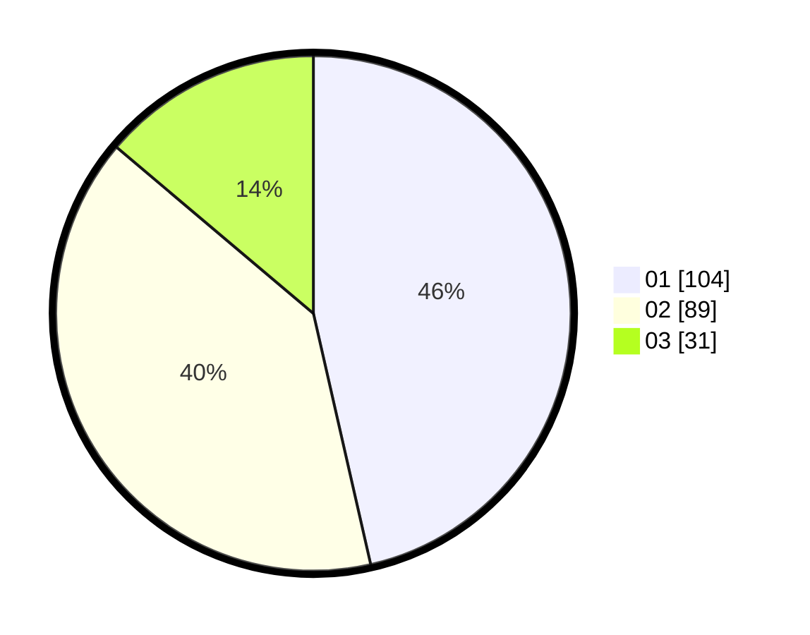

# Hasil

Hasil perolehan suara paslon dapat dilihat pada file paslon-01.txt, paslon-02.txt, dan paslon-03.txt.

Jika tidak ada, artinya data tersebut belum ada pada SIREKAP.

## Perolehan Suara

 * Paslon 01: **104**.
 * Paslon 02: **89**.
 * Paslon 03: **31**.

## Foto C Plano

https://sirekap-obj-formc.kpu.go.id/a523/pemilu/ppwp/31/75/09/10/03/3175091003004-20240216-163615--2c3b663f-d559-4c5a-b327-a12cdad0c7a9.jpg

https://sirekap-obj-formc.kpu.go.id/a523/pemilu/ppwp/31/75/09/10/03/3175091003004-20240214-184804--b02ac7cb-f3a1-418d-ba3f-9b67e2ef634c.jpg

https://sirekap-obj-formc.kpu.go.id/a523/pemilu/ppwp/31/75/09/10/03/3175091003004-20240214-184637--965323da-61e6-467e-a23f-b58a727793e4.jpg
