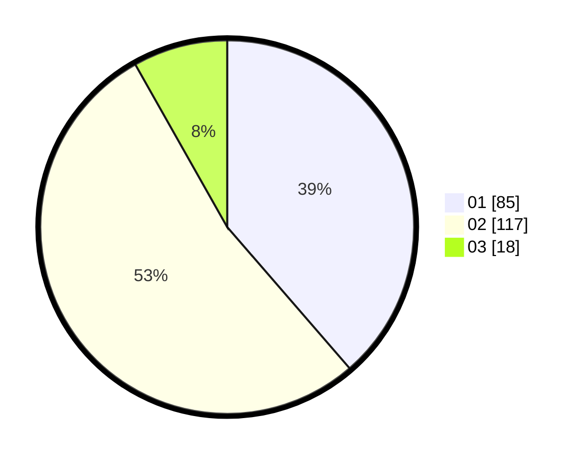

# Hasil

Hasil perolehan suara paslon dapat dilihat pada file paslon-01.txt, paslon-02.txt, dan paslon-03.txt.

Jika tidak ada, artinya data tersebut belum ada pada SIREKAP.

## Perolehan Suara

 * Paslon 01: **85**.
 * Paslon 02: **117**.
 * Paslon 03: **18**.

## Foto C Plano

https://sirekap-obj-formc.kpu.go.id/dbe0/pemilu/ppwp/31/75/09/10/03/3175091003005-20240214-155031--6b48f506-7bff-43f5-aed8-111895f8952b.jpg

https://sirekap-obj-formc.kpu.go.id/dbe0/pemilu/ppwp/31/75/09/10/03/3175091003005-20240214-155539--1cb685bb-6d51-4a17-bb64-279ed68bb3c7.jpg

https://sirekap-obj-formc.kpu.go.id/dbe0/pemilu/ppwp/31/75/09/10/03/3175091003005-20240214-155718--ec5f1df8-19b7-4d97-a4b8-76b0b98d53dd.jpg

## DATA PEMILIH TETAP

Jumlah pemilih dalam DPT: **269**.
 * L: **135**.
 * P: **134**.

## DATA PENGGUNA HAK PILIH

Jumlah pengguna hak pilih dalam DPT: **219**.
 * L: **106**.
 * P: **113**.

Jumlah pengguna hak pilih dalam DPTb: **2**.
 * L: **2**.
 * P: **0**.

Jumlah pengguna hak pilih dalam DPK: **1**.
 * L: **1**.
 * P: **0**.

Jumlah pengguna hak pilih: **222**.
 * L: **109**.
 * P: **113**.

## JUMLAH SUARA SAH DAN TIDAK SAH

JUMLAH SELURUH SUARA SAH: **220**.

JUMLAH SUARA TIDAK SAH: **2**.

JUMLAH SELURUH SUARA SAH DAN SUARA TIDAK SAH: **222**.
