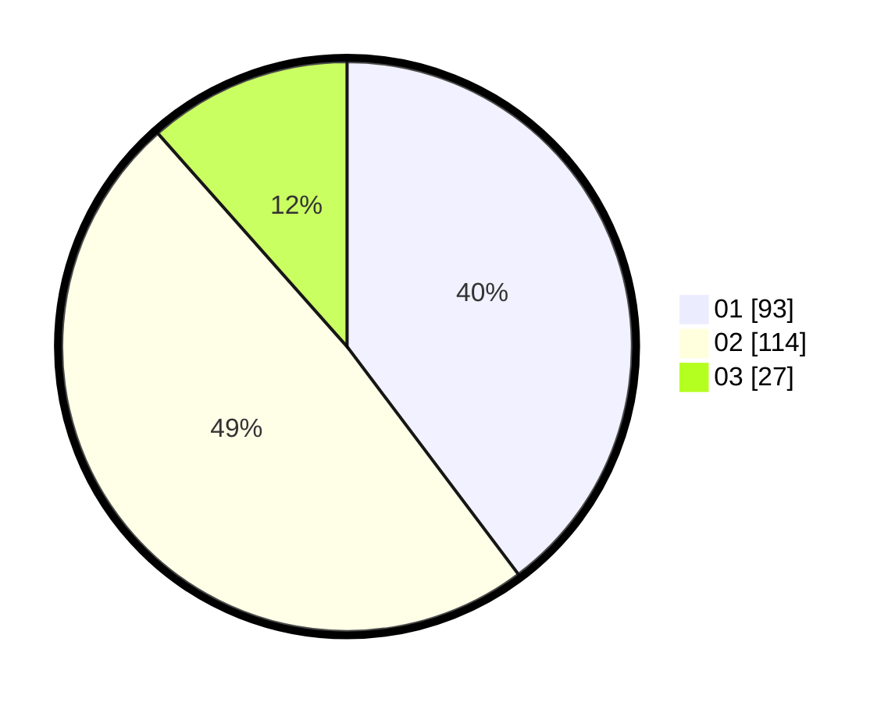

# Hasil

Hasil perolehan suara paslon dapat dilihat pada file paslon-01.txt, paslon-02.txt, dan paslon-03.txt.

Jika tidak ada, artinya data tersebut belum ada pada SIREKAP.

## Perolehan Suara

 * Paslon 01: **93**.
 * Paslon 02: **114**.
 * Paslon 03: **27**.

## Foto C Plano

https://sirekap-obj-formc.kpu.go.id/5100/pemilu/ppwp/31/75/09/10/03/3175091003006-20240214-200923--27d4db3f-beca-4ca0-bce2-119d959ccc98.jpg

https://sirekap-obj-formc.kpu.go.id/5100/pemilu/ppwp/31/75/09/10/03/3175091003006-20240214-201112--fc5c2abd-35c4-42aa-b66d-2569668c762a.jpg

https://sirekap-obj-formc.kpu.go.id/5100/pemilu/ppwp/31/75/09/10/03/3175091003006-20240214-201114--f699129a-54ce-4b4b-afc8-5dcb03047284.jpg

## DATA PEMILIH TETAP

Jumlah pemilih dalam DPT: **264**.
 * L: **130**.
 * P: **134**.

## DATA PENGGUNA HAK PILIH

Jumlah pengguna hak pilih dalam DPT: **241**.
 * L: **118**.
 * P: **123**.

Jumlah pengguna hak pilih dalam DPTb: **0**.
 * L: **0**.
 * P: **0**.

Jumlah pengguna hak pilih dalam DPK: **0**.
 * L: **0**.
 * P: **0**.

Jumlah pengguna hak pilih: **241**.
 * L: **118**.
 * P: **123**.

## JUMLAH SUARA SAH DAN TIDAK SAH

JUMLAH SELURUH SUARA SAH: **234**.

JUMLAH SUARA TIDAK SAH: **7**.

JUMLAH SELURUH SUARA SAH DAN SUARA TIDAK SAH: **241**.
