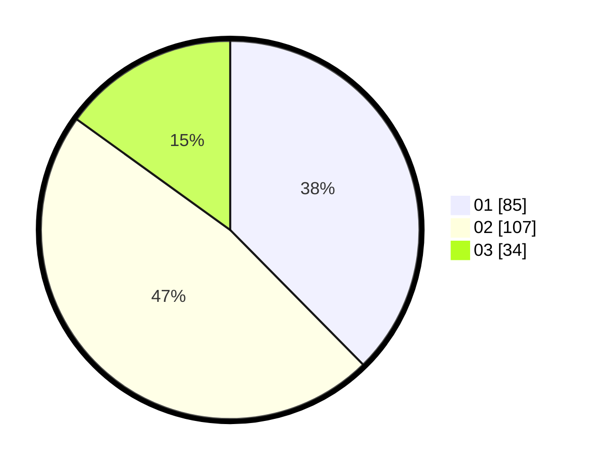

# Hasil

Hasil perolehan suara paslon dapat dilihat pada file paslon-01.txt, paslon-02.txt, dan paslon-03.txt.

Jika tidak ada, artinya data tersebut belum ada pada SIREKAP.

## Perolehan Suara

 * Paslon 01: **85**.
 * Paslon 02: **107**.
 * Paslon 03: **34**.

## Foto C Plano

https://sirekap-obj-formc.kpu.go.id/e78e/pemilu/ppwp/31/75/09/10/03/3175091003007-20240214-235245--9e8b0b17-e765-4174-b420-29aa9bb373d9.jpg

https://sirekap-obj-formc.kpu.go.id/e78e/pemilu/ppwp/31/75/09/10/03/3175091003007-20240214-235437--4fe1d0f5-fa18-412e-bfe8-121bcb0fa0c4.jpg

https://sirekap-obj-formc.kpu.go.id/e78e/pemilu/ppwp/31/75/09/10/03/3175091003007-20240214-235639--a65e0281-c8a4-4783-a037-c1098b5c0218.jpg
