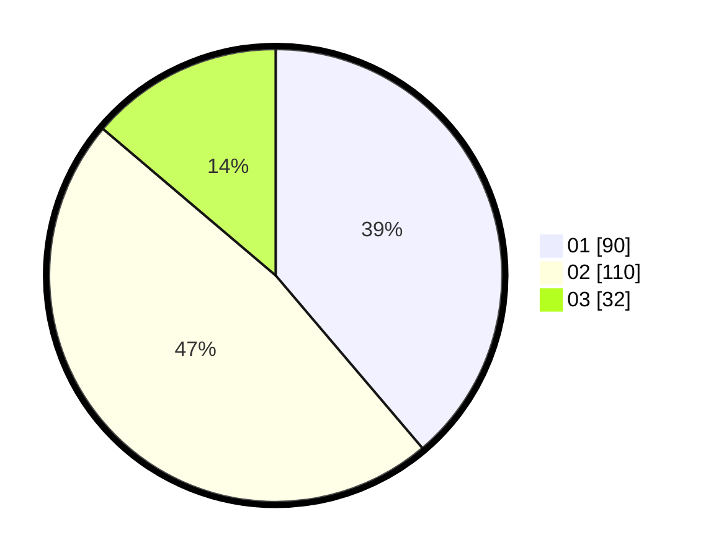

# Hasil

Hasil perolehan suara paslon dapat dilihat pada file paslon-01.txt, paslon-02.txt, dan paslon-03.txt.

Jika tidak ada, artinya data tersebut belum ada pada SIREKAP.

## Perolehan Suara

 * Paslon 01: **90**.
 * Paslon 02: **110**.
 * Paslon 03: **32**.

## Foto C Plano

https://sirekap-obj-formc.kpu.go.id/759c/pemilu/ppwp/31/75/09/10/03/3175091003009-20240216-123028--0102c381-52b2-438a-b40f-0c7274e1dcac.jpg

https://sirekap-obj-formc.kpu.go.id/759c/pemilu/ppwp/31/75/09/10/03/3175091003009-20240216-123033--60f7c064-54d9-49ea-a1bb-66ecbdda61b4.jpg

https://sirekap-obj-formc.kpu.go.id/759c/pemilu/ppwp/31/75/09/10/03/3175091003009-20240216-123031--3750462e-fb34-4f48-8354-6357b1817cb1.jpg

## DATA PEMILIH TETAP

Jumlah pemilih dalam DPT: **268**.
 * L: **141**.
 * P: **127**.

## DATA PENGGUNA HAK PILIH

Jumlah pengguna hak pilih dalam DPT: **235**.
 * L: **118**.
 * P: **117**.

Jumlah pengguna hak pilih dalam DPTb: **0**.
 * L: **0**.
 * P: **0**.

Jumlah pengguna hak pilih dalam DPK: **0**.
 * L: **0**.
 * P: **0**.

Jumlah pengguna hak pilih: **235**.
 * L: **118**.
 * P: **117**.

## JUMLAH SUARA SAH DAN TIDAK SAH

JUMLAH SELURUH SUARA SAH: **232**.

JUMLAH SUARA TIDAK SAH: **3**.

JUMLAH SELURUH SUARA SAH DAN SUARA TIDAK SAH: **235**.
