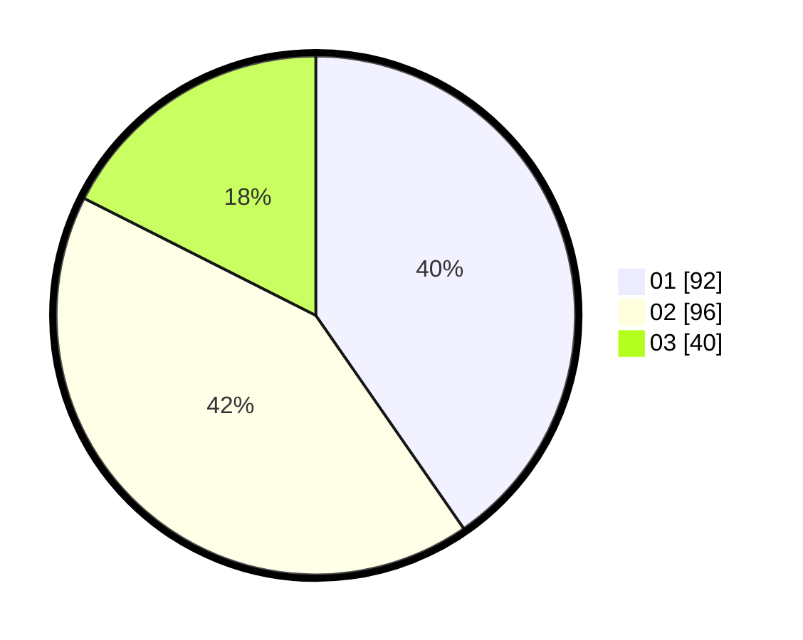

# Hasil

Hasil perolehan suara paslon dapat dilihat pada file paslon-01.txt, paslon-02.txt, dan paslon-03.txt.

Jika tidak ada, artinya data tersebut belum ada pada SIREKAP.

## Perolehan Suara

 * Paslon 01: **92**.
 * Paslon 02: **96**.
 * Paslon 03: **40**.

## Foto C Plano

https://sirekap-obj-formc.kpu.go.id/5643/pemilu/ppwp/31/75/09/10/03/3175091003011-20240215-013254--436f2aa3-a671-40a7-8d15-171ca6a283fd.jpg

https://sirekap-obj-formc.kpu.go.id/5643/pemilu/ppwp/31/75/09/10/03/3175091003011-20240215-013350--d753d6d7-91de-4153-a644-56ac240baa5b.jpg

https://sirekap-obj-formc.kpu.go.id/5643/pemilu/ppwp/31/75/09/10/03/3175091003011-20240215-013445--5725621d-9c53-471a-bf64-23e0f4e8f811.jpg

## DATA PEMILIH TETAP

Jumlah pemilih dalam DPT: **292**.
 * L: **140**.
 * P: **152**.

## DATA PENGGUNA HAK PILIH

Jumlah pengguna hak pilih dalam DPT: **230**.
 * L: **105**.
 * P: **125**.

Jumlah pengguna hak pilih dalam DPTb: **1**.
 * L: **1**.
 * P: **0**.

Jumlah pengguna hak pilih dalam DPK: **1**.
 * L: **1**.
 * P: **0**.

Jumlah pengguna hak pilih: **232**.
 * L: **107**.
 * P: **125**.

## JUMLAH SUARA SAH DAN TIDAK SAH

JUMLAH SELURUH SUARA SAH: **228**.

JUMLAH SUARA TIDAK SAH: **4**.

JUMLAH SELURUH SUARA SAH DAN SUARA TIDAK SAH: **232**.
