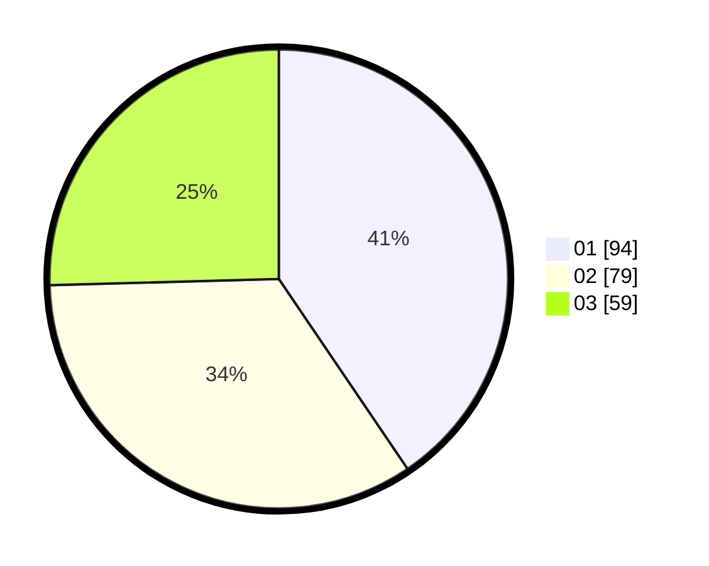

# Hasil

Hasil perolehan suara paslon dapat dilihat pada file paslon-01.txt, paslon-02.txt, dan paslon-03.txt.

Jika tidak ada, artinya data tersebut belum ada pada SIREKAP.

## Perolehan Suara

 * Paslon 01: **94**.
 * Paslon 02: **79**.
 * Paslon 03: **59**.

## Foto C Plano

https://sirekap-obj-formc.kpu.go.id/82f8/pemilu/ppwp/31/75/09/10/03/3175091003015-20240214-155420--6c1ed100-7bb1-4932-95fa-0d229cbbe0d5.jpg

https://sirekap-obj-formc.kpu.go.id/82f8/pemilu/ppwp/31/75/09/10/03/3175091003015-20240214-155444--563654f4-b6e5-4c2d-b0f1-67b90c439282.jpg

https://sirekap-obj-formc.kpu.go.id/82f8/pemilu/ppwp/31/75/09/10/03/3175091003015-20240214-155558--73c66f13-4cfd-4f8f-bb8e-ebf7b404bb6f.jpg

## DATA PEMILIH TETAP

Jumlah pemilih dalam DPT: **281**.
 * L: **139**.
 * P: **142**.

## DATA PENGGUNA HAK PILIH

Jumlah pengguna hak pilih dalam DPT: **232**.
 * L: **109**.
 * P: **123**.

Jumlah pengguna hak pilih dalam DPTb: **2**.
 * L: **1**.
 * P: **1**.

Jumlah pengguna hak pilih dalam DPK: **0**.
 * L: **0**.
 * P: **0**.

Jumlah pengguna hak pilih: **234**.
 * L: **110**.
 * P: **124**.

## JUMLAH SUARA SAH DAN TIDAK SAH

JUMLAH SELURUH SUARA SAH: **232**.

JUMLAH SUARA TIDAK SAH: **2**.

JUMLAH SELURUH SUARA SAH DAN SUARA TIDAK SAH: **234**.
