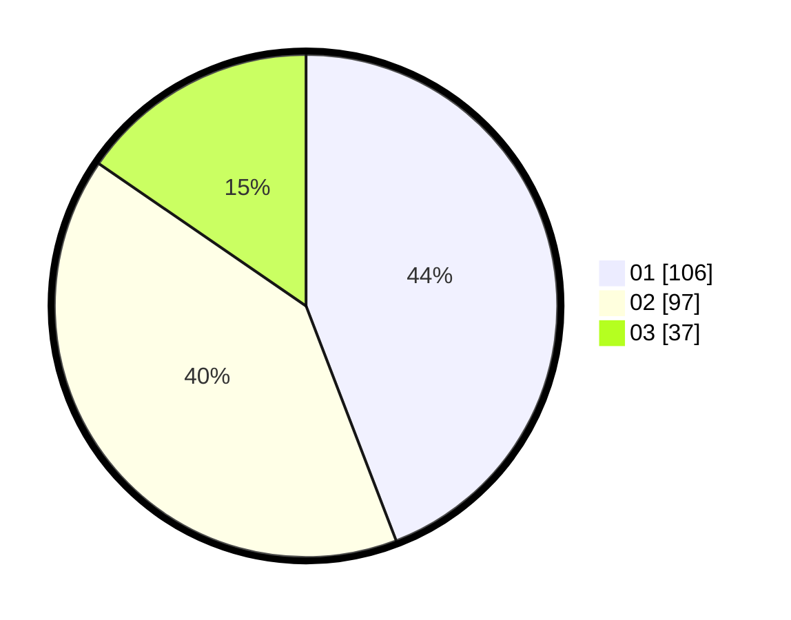

# Hasil

Hasil perolehan suara paslon dapat dilihat pada file paslon-01.txt, paslon-02.txt, dan paslon-03.txt.

Jika tidak ada, artinya data tersebut belum ada pada SIREKAP.

## Perolehan Suara

 * Paslon 01: **106**.
 * Paslon 02: **97**.
 * Paslon 03: **37**.

## Foto C Plano

https://sirekap-obj-formc.kpu.go.id/acd3/pemilu/ppwp/31/75/09/10/03/3175091003018-20240214-155747--5c692d5b-f2c8-4877-a96e-818a9af1439a.jpg

https://sirekap-obj-formc.kpu.go.id/acd3/pemilu/ppwp/31/75/09/10/03/3175091003018-20240214-211345--e7f019e8-6581-4cb6-8803-09512cca032a.jpg

https://sirekap-obj-formc.kpu.go.id/acd3/pemilu/ppwp/31/75/09/10/03/3175091003018-20240214-204118--e53809ae-38cf-45bb-a9ca-1d117a959678.jpg

## DATA PEMILIH TETAP

Jumlah pemilih dalam DPT: **276**.
 * L: **127**.
 * P: **149**.

## DATA PENGGUNA HAK PILIH

Jumlah pengguna hak pilih dalam DPT: **241**.
 * L: **105**.
 * P: **136**.

Jumlah pengguna hak pilih dalam DPTb: **1**.
 * L: **1**.
 * P: **0**.

Jumlah pengguna hak pilih dalam DPK: **0**.
 * L: **0**.
 * P: **0**.

Jumlah pengguna hak pilih: **242**.
 * L: **106**.
 * P: **136**.

## JUMLAH SUARA SAH DAN TIDAK SAH

JUMLAH SELURUH SUARA SAH: **240**.

JUMLAH SUARA TIDAK SAH: **2**.

JUMLAH SELURUH SUARA SAH DAN SUARA TIDAK SAH: **242**.
